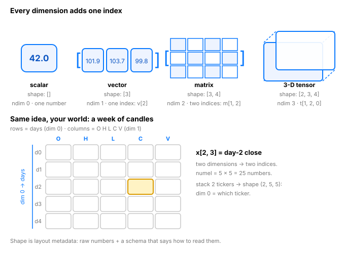

# Day 2 — Tensors: The Universal Container

**Tonight you'll be able to:** read any tensor's `.shape` and picture exactly what's inside it — scalars, vectors, matrices, and batches.

## The one idea

Everything in AI is a **tensor**: a multidimensional array of numbers with a **shape**. Images, text, audio, prices — all of it gets packed into tensors before a model ever touches it.

Think of it as a ladder. Each rung adds one dimension — one more index you need to pin down a single number:

- **Scalar** — one number. Shape `[]`, `ndim 0`. `torch.tensor(42.0)`
- **Vector** — a list. Shape `[3]`, `ndim 1`. One index: `v[2]`
- **Matrix** — rows × columns. Shape `[3, 4]`, `ndim 2`. Two indices: `m[1, 2]`
- **3-D tensor** — a stack (batch) of matrices. Shape `[2, 3, 4]`, `ndim 3`. Three indices: `t[1, 2, 0]`

Two things to carry forever:

1. **`.shape` is the contract.** Almost every ML bug is a shape mismatch — two tensors that don't line up, like sending a payload that fails schema validation. Reading shapes fluently is the #1 debugging skill in deep learning.
2. **`.numel()` counts the numbers** — it's just the product of the shape: a `[2, 3, 4]` tensor holds 2 × 3 × 4 = 24 numbers. You'll also meet `.dtype` (float32 vs int64 — precision matters) and `.device` (cpu vs mps).

## Analogy

**Typed byte buffers.** In Conveyor, an object is a flat byte buffer — the erasure-coding layout and part sizes are the metadata that tells you how to slice it back into pieces. A tensor is the same deal: a flat buffer of floats, plus `.shape` as the layout descriptor that makes the bytes meaningful. `torch.zeros(3, 4)` allocates 12 contiguous floats; the shape says "read them as 3 rows of 4."

**Your market data already thinks in tensors.** One candle (O,H,L,C,V) is a vector of 5. A week of candles is a `[5, 5]` matrix. Two tickers of candles is a `[2, 5, 5]` batch — dim 0 picks the ticker, dim 1 the day, dim 2 the field. Models always think in batches; shape is how you address the batch.

## See it



## Code it (~30 min)

Run this in your `~/ai-lab` venv. The same file ships as `code.py` in this folder.

```python
import torch

device = "mps" if torch.backends.mps.is_available() else "cpu"
print("using device:", device)

print("\n--- 1. The ladder: scalar -> vector -> matrix ---")
scalar = torch.tensor(42.0)                            # a single number
vector = torch.tensor([101.90, 103.70, 99.80])         # one ticker's closes
matrix = torch.tensor([[1., 2., 3.],
                       [4., 5., 6.]])                  # rows x cols

print("scalar:", scalar.shape, " ndim:", scalar.ndim, " numel:", scalar.numel())
print("vector:", vector.shape, " ndim:", vector.ndim, " numel:", vector.numel())
print("matrix:", matrix.shape, " ndim:", matrix.ndim, " numel:", matrix.numel())
print(matrix)

print("\n--- 2. One ticker's candles = a (2, 5) matrix ---")
# rows = days (dim 0), cols = O H L C V, volume in millions (dim 1)
aapl = torch.tensor([
    [100.50, 102.30,  99.80, 101.90, 1.25],   # day 0
    [101.90, 104.10, 101.20, 103.70, 1.48],   # day 1
], device=device)
print("shape:", aapl.shape, "| dtype:", aapl.dtype, "| device:", aapl.device.type)
print("day-0 candle:", aapl[0])
print("day-1 close :", aapl[1, 3].item())

print("\n--- 3. Batch two tickers = a (2, 2, 5) tensor ---")
nvda = torch.tensor([
    [187.20, 189.50, 186.10, 188.80, 2.10],
    [188.80, 191.40, 188.00, 190.60, 2.44],
], device=device)
batch = torch.stack([aapl, nvda])   # new dim 0 = which ticker
print("shape:", batch.shape, "| ndim:", batch.ndim, "| numel:", batch.numel())
print("NVDA, day-1 close:", batch[1, 1, 3].item())

print("\n--- 4. Shape is just layout metadata ---")
buf = torch.zeros(2, 5, device=device)   # empty candle buffer, same layout as aapl
print("zeros:", buf.shape, "numel:", buf.numel())
flat = aapl.reshape(-1)                  # flatten; -1 means 'figure it out'
print("flattened:", flat.shape)

print("\n--- 5. Integers vs floats: dtype matters ---")
print("int tensor dtype:  ", torch.tensor([1, 2, 3]).dtype)
print("float tensor dtype:", torch.tensor([1., 2., 3.]).dtype)
```

**Expected output:**

```
using device: mps

--- 1. The ladder: scalar -> vector -> matrix ---
scalar: torch.Size([])  ndim: 0  numel: 1
vector: torch.Size([3])  ndim: 1  numel: 3
matrix: torch.Size([2, 3])  ndim: 2  numel: 6
tensor([[1., 2., 3.],
        [4., 5., 6.]])

--- 2. One ticker's candles = a (2, 5) matrix ---
shape: torch.Size([2, 5]) | dtype: torch.float32 | device: mps
day-0 candle: tensor([100.5000, 102.3000,  99.8000, 101.9000,   1.2500])
day-1 close : 103.7

--- 3. Batch two tickers = a (2, 2, 5) tensor ---
shape: torch.Size([2, 2, 5]) | ndim: 3 | numel: 20
NVDA, day-1 close: 190.6

--- 4. Shape is just layout metadata ---
zeros: torch.Size([2, 5]) numel: 10
flattened: torch.Size([10])

--- 5. Integers vs floats: dtype matters ---
int tensor dtype:   torch.int64
float tensor dtype: torch.float32
```

## Today's win

**Done when:** you run `python3 code.py` in `~/ai-lab` and every shape matches the expected output — then, in a REPL, correctly *predict* `.shape`, `.ndim`, and `.numel()` for `torch.zeros(4, 3, 2)` before printing them. (Answer: `[4, 3, 2]`, 3, 24 — a batch of 4 matrices, 3 rows × 2 cols.)

Two days down. Systems beat motivation — same time tomorrow.

## Short on time? 20-minute version

Read "The one idea" and the analogy (8 min), run `code.py` and match the expected output (10 min). If you only remember one thing: **each dimension adds one index, and `.shape` is the contract everything checks against.**

## Tomorrow's teaser

Tomorrow: from containers to computation — the vectorized ops that update a million candles in a single line. No loops allowed.

---
*Streak: 2 day(s) · Never miss twice.*
