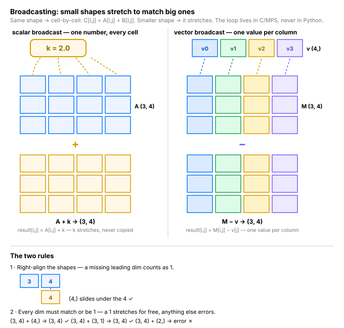

# Day 3 — Tensor Ops & Broadcasting

**Tonight you'll be able to:** write vectorized tensor ops — element-wise math, reductions, matmul, and broadcasting — and predict output shapes before you run.

## The one idea

Day 2 gave you the containers. Today: the three verbs of tensor math.

1. **Transform, cell by cell.** `a + b`, `a * 2`, `torch.sqrt(a)` — element-wise ops apply to each cell independently. No Python loop: the loop is compiled C/MPS code running across thousands of lanes at once.
2. **Collapse a dimension.** `.sum()`, `.mean(dim=0)`, `.max(dim=1)` — a reduction folds one dim away. A `(3, 5)` of candles becomes a `(5,)` of column means. `keepdim=True` keeps the dim as size 1 so the result still broadcasts later.
3. **Combine with `@` (matmul).** `(2, 3) @ (3, 5)` → `(2, 5)`: the inner dims contract, and each output cell is a dot product of a row and a column. `*` is cell-by-cell; `@` is the one that *mixes*. Nearly every neural net is a stack of matmuls.

The rule that makes them compose is **broadcasting**. When shapes differ, PyTorch right-aligns them: each dim must match or be 1, a 1 stretches to fit, anything else is a `RuntimeError`. `(3, 4) + (4,)` works — the vector stretches down the rows. `(3, 4) + (2,)` doesn't — 3 ≠ 2 on the trailing dim. Reading a shape error is now a five-second skill.

## Analogy

**SIMD lanes / fleet fan-out.** A vectorized op is one instruction across N lanes — like pushing a single config change to every instance in a fleet at once instead of SSH-ing into each box. The Python-loop version is the SSH-into-each-box version: same result, orders of magnitude more round trips.

**Broadcasting is `MPI_Bcast` for tensors.** In a broadcast, one rank holds the value and every worker reads it — nobody copies it to each worker first. PyTorch pulls the same stride trick: `(3,4) + (4,)` never materializes three copies of the vector; every row just reads the one copy. Same as applying one risk limit to every row of a positions table without replicating the column.

## See it



## Code it (~30 min)

Run this in your `~/ai-lab` venv — the same file ships as `code.py` in this folder. Watch the shapes in the prints: every op below is legal only because the shapes line up.

```python
"""Day 3: Tensor ops & broadcasting.

Element-wise math, reductions, matmul, and the two broadcasting
rules -- the shape-debugging skill every later lesson builds on.
Run:  python3 code.py   (inside the ~/ai-lab venv)
"""
import time
import torch

device = "mps" if torch.backends.mps.is_available() else "cpu"
print("using device:", device)

print("\n--- 1. Vectorized: the loop lives in C, not Python ---")
closes = torch.tensor([101.90, 103.70, 105.10, 104.40, 106.20], device=device)
pct = (closes[1:] - closes[:-1]) / closes[:-1] * 100   # daily % change, one line
print("closes shape:", closes.shape)
print("daily % change:", " ".join(f"{x:.3f}" for x in pct))

n = 200_000
big = torch.linspace(100, 110, n, device=device)
t0 = time.perf_counter()
looped = torch.empty_like(big)
for i in range(n):
    looped[i] = big[i] * 1.02
t1 = time.perf_counter()
vec = big * 1.02
t2 = time.perf_counter()
assert torch.allclose(looped, vec)
print(f"python loop over {n:,} cells: {(t1-t0)*1000:7.1f} ms")
print(f"one vectorized op       : {(t2-t1)*1000:7.2f} ms")

print("\n--- 2. Broadcasting: small shapes stretch ---")
candles = torch.tensor([                    # (3, 5): 3 days x O H L C V
    [100.50, 102.30,  99.80, 101.90, 1.25],
    [101.90, 104.10, 101.20, 103.70, 1.48],
    [103.70, 105.20, 102.90, 104.80, 1.61],
], device=device)
col_mean = candles.mean(dim=0)              # (5,): one mean per column
demeaned = candles - col_mean               # (3,5) - (5,) -> (3,5)
print("col means :", " ".join(f"{x:6.2f}" for x in col_mean))
print("shapes    :", candles.shape, "-", col_mean.shape, "->", demeaned.shape)

ohlc = candles[:, :4]                       # (3, 4)
day_open = ohlc[:, :1]                      # (3, 1)
rel = ohlc / day_open                       # (3,4) / (3,1): prices vs their open
print("day-0 as % of open:", " ".join(f"{x:5.1f}" for x in rel[0] * 100))
print("shapes    :", ohlc.shape, "/", day_open.shape, "->", rel.shape)

print("\n--- 3. The two rules, and the classic error ---")
a = torch.zeros(4, 3) + torch.zeros(3)        # trailing dims align      -> (4, 3)
b = torch.zeros(4, 3) + torch.zeros(4, 1)     # size-1 stretches         -> (4, 3)
print("ok  :", a.shape, b.shape)
try:
    torch.zeros(4, 3) + torch.zeros(2)        # 3 vs 2: match? no. 1? no. -> error
except RuntimeError as e:
    print("fail:", str(e).splitlines()[0])

print("\n--- 4. Reductions + matmul: collapse, then combine ---")
rng = candles[:, 1] - candles[:, 2]          # daily range H - L
print("daily range:", " ".join(f"{x:.2f}" for x in rng))
print(f"widest day: {rng.max().item():.2f} | avg range: {rng.mean().item():.2f}")

rets = torch.tensor([[ 0.012, -0.004,  0.018],   # META, 3 days
                     [ 0.031,  0.022, -0.009]],  # NVDA, 3 days
                    device=device)               # (2, 3)
w = torch.tensor([0.6, 0.4], device=device)      # (2,) portfolio weights
port = w @ rets                                  # (2,) @ (2, 3) -> (3,)
print("shapes:", w.shape, "@", rets.shape, "->", port.shape)
print("portfolio daily returns:", " ".join(f"{x:+.2%}" for x in port))
```

**Expected output:**

```
using device: mps

--- 1. Vectorized: the loop lives in C, not Python ---
closes shape: torch.Size([5])
daily % change: 1.766 1.350 -0.666 1.724
python loop over 200,000 cells:    84.3 ms
one vectorized op       :    0.05 ms

--- 2. Broadcasting: small shapes stretch ---
col means : 102.03 103.87 101.30 103.47   1.45
shapes    : torch.Size([3, 5]) - torch.Size([5]) -> torch.Size([3, 5])
day-0 as % of open: 100.0 101.8  99.3 101.4
shapes    : torch.Size([3, 4]) / torch.Size([3, 1]) -> torch.Size([3, 4])

--- 3. The two rules, and the classic error ---
ok  : torch.Size([4, 3]) torch.Size([4, 3])
fail: The size of tensor a (3) must match the size of tensor b (2) at non-singleton dimension 1

--- 4. Reductions + matmul: collapse, then combine ---
daily range: 2.50 2.90 2.30
widest day: 2.90 | avg range: 2.57
shapes: torch.Size([2]) @ torch.Size([2, 3]) -> torch.Size([3])
portfolio daily returns: +1.96% +0.64% +0.72%
```

(Your two timing lines in section 1 will differ by machine — what matters is the vectorized line being far smaller than the loop line.)

## Today's win

**Done when:** `code.py` runs and every shape matches the expected output — then, in a REPL, *predict* the result shape of `torch.zeros(4,3) + torch.zeros(3)`, `torch.zeros(4,3) + torch.zeros(4,1)`, and `torch.zeros(4,3) + torch.zeros(2)` before printing. (Answers: `(4,3)`, `(4,3)`, `RuntimeError` — 3 vs 2 on the trailing dim.)

Three days down. Systems beat motivation — same time tomorrow.

## Short on time? 20-minute version

Read "The one idea" and the analogy (8 min), run sections 2–3 of `code.py` and match the shapes (10 min). If you only remember one thing: **right-align the shapes — a dim of 1 stretches, anything else that doesn't match errors.**

## Tomorrow's teaser

Tomorrow: what if a tensor kept a receipt for every op you just ran on it — and could play the tape backward? The tracer behind every model that learns.

---
*Streak: 3 day(s) · Never miss twice.*
