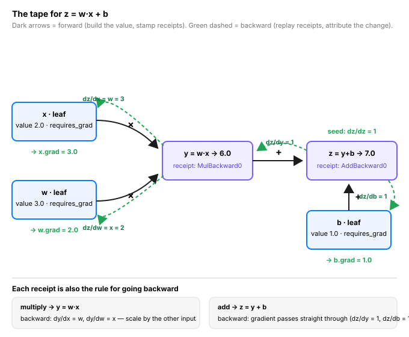

# Day 4 — Autograd: The Tape Recorder

**Tonight you'll be able to:** explain what `requires_grad` does, read a `grad_fn` chain, and compute exact gradients with `.backward()` — the machinery under every training loop.

## The one idea

Days 1–3 gave you tensors and ops. Today's question: how does PyTorch *learn*? One mechanism: **autograd, the tape recorder**. Mark a tensor with `requires_grad=True` and PyTorch starts recording: every op on that tensor stamps a **receipt** — a `grad_fn` — linking the output back to its inputs. Run ten ops and you've built a one-way graph of everything that happened: the computation tape.

Call `z.backward()` and PyTorch replays the tape **in reverse**. It starts at the output with one fact — "the output moved by 1" — and walks backward, asking each receipt: "how much did each of your inputs move the output?" That number is the **gradient**: a sensitivity knob. `dz/dx = 3` means nudging `x` up by 0.01 nudges `z` up by about 0.03. The chain rule is just this question asked receipt by receipt, multiplied together — no calculus homework required.

Three house rules, learned once:

- **Only leaves collect grads.** Intermediate tensors (`y`, `z`) get receipts but no `.grad` — the leaves (your `x`, `w`, `b`) are where gradients land.
- **Grads accumulate.** Call `.backward()` twice without `zero_grad()` and the grads *add*. Optimizers reset every step — forget it and your updates silently double.
- **Backward needs a single number.** `.backward()` starts from one scalar — that's why a training loop always ends in one scalar loss. (Tomorrow: where that number comes from.)

## Analogy

**Distributed request tracing — for math.** Serve a request through five microservices and each hop emits a span, parent linked to child; the whole trace is a DAG of *who called whom*. A tensor op is a span: `grad_fn` is the span metadata, the computation graph is the trace. And `.backward()`? That's the incident-review walk: start at the final response, walk the trace *backward*, and ask every span "how much did you contribute to this outcome?" — exactly how you'd attribute a p99 latency spike to one downstream call.

No tracing in prod means mystery outages. No autograd means hand-deriving every gradient — the way ML was done before 2015. The tape is the observability layer that makes learning possible.

## See it



## Code it (~30 min)

Run this in your `~/ai-lab` venv — the same file ships as `code.py` in this folder. Watch `grad_fn`: every op on a recorded tensor stamps one.

```python
"""Day 4: Autograd -- the tape recorder.

Every op on a requires_grad tensor stamps a receipt (grad_fn).
z.backward() replays the tape in reverse, filling .grad on the
leaves. Grads accumulate -- you own zero_grad().
Run:  python3 code.py   (inside the ~/ai-lab venv)
"""
import torch

device = "mps" if torch.backends.mps.is_available() else "cpu"
print("using device:", device)

print("\n--- 1. The tape: every op leaves a receipt ---")
x = torch.tensor(2.0, requires_grad=True, device=device)  # leaf
w = torch.tensor(3.0, requires_grad=True, device=device)  # leaf
b = torch.tensor(1.0, requires_grad=True, device=device)  # leaf

y = w * x              # 6.0 -- stamps MulBackward0
z = y + b              # 7.0 -- stamps AddBackward0
print("y.grad_fn:", type(y.grad_fn).__name__)
print("z.grad_fn:", type(z.grad_fn).__name__)
print("x is a leaf:", x.is_leaf, "| x.grad_fn:", x.grad_fn)

z.backward()           # replay the tape from z back to the leaves
print("dz/dx =", x.grad.item(), "(expected: w = 3)")
print("dz/dw =", w.grad.item(), "(expected: x = 2)")
print("dz/db =", b.grad.item(), "(expected: 1)")

print("\n--- 2. Grads accumulate -- you own the reset ---")
p = torch.tensor([1.0, 2.0, 3.0], requires_grad=True, device=device)
(p ** 2).sum().backward()        # dL/dp = 2p -> [2, 4, 6]
print("after backward #1:", p.grad)
(p ** 2).sum().backward()        # no reset: grads ADD -> [4, 8, 12]
print("after backward #2 (no zero):", p.grad)
p.grad.zero_()                   # the reset optimizers do every step
(p ** 2).sum().backward()
print("after zero_ + backward:", p.grad)

print("\n--- 3. Chain rule, the trading way ---")
# Portfolio value from two positions: v = w1*r1 + w2*r2.
# The gradient answers: which weight moves the value most per unit nudge?
r = torch.tensor([0.02, -0.01], device=device)        # today's returns: fixed data
w = torch.tensor([0.6, 0.4], requires_grad=True, device=device)
v = (w * r).sum()                                    # 0.0080
v.backward()                                         # dv/dw = r
print(f"value: {v.item():.4f}")
print("d value / d weights:", w.grad)
print("-> w[0] has twice the pull of w[1], and opposite sign")

print("\n--- 4. Turn the recorder off ---")
x = torch.tensor(2.0, requires_grad=True, device=device)
with torch.no_grad():          # eval / inference: skip the tape entirely
    y = x * 2
print("inside no_grad, y.grad_fn:", y.grad_fn)
z = x.detach() * 2             # detach: one tensor opts out, recorder keeps running
print("detached,        z.grad_fn:", z.grad_fn)
print("x.grad:", x.grad)       # None -- we never called backward here

print("\n--- bonus: the tape is exact ---")
# Finite-difference sanity check: autograd == numeric derivative.
x = torch.tensor(2.0, requires_grad=True, device=device)
w = torch.tensor(3.0, requires_grad=True, device=device)
b = torch.tensor(1.0, requires_grad=True, device=device)
(w * x + b).backward()
eps = 1e-4
fd = ((3.0 * (2.0 + eps) + 1.0) - (3.0 * (2.0 - eps) + 1.0)) / (2 * eps)
print(f"autograd dz/dx: {x.grad.item():.4f}   finite-difference: {fd:.4f}")
```

**Expected output:**

```
using device: mps

--- 1. The tape: every op leaves a receipt ---
y.grad_fn: MulBackward0
z.grad_fn: AddBackward0
x is a leaf: True | x.grad_fn: None
dz/dx = 3.0 (expected: w = 3)
dz/dw = 2.0 (expected: x = 2)
dz/db = 1.0 (expected: 1)

--- 2. Grads accumulate -- you own the reset ---
after backward #1: tensor([2., 4., 6.])
after backward #2 (no zero): tensor([4., 8., 12.])
after zero_ + backward: tensor([2., 4., 6.])

--- 3. Chain rule, the trading way ---
value: 0.0080
d value / d weights: tensor([ 0.0200, -0.0100])
-> w[0] has twice the pull of w[1], and opposite sign

--- 4. Turn the recorder off ---
inside no_grad, y.grad_fn: None
detached,        z.grad_fn: None
x.grad: None

--- bonus: the tape is exact ---
autograd dz/dx: 3.0000   finite-difference: 3.0000
```

## Today's win

**Done when:** `code.py` runs and your prints match — section 1 grads are `3.0 / 2.0 / 1.0`, section 2's second backward doubles the grads until `zero_()`, and the bonus finite-difference line agrees to 4 decimals. Then in a REPL, *predict* `x.grad` for `z = x**2` at `x = 3` before running. (Answer: `6.0` — d(x²)/dx = 2x.)

Four days down. Systems beat motivation — same time tomorrow.

## Short on time? 20-minute version

Read "The one idea" and the analogy (10 min), run sections 1 and 4 of `code.py` and inspect the `grad_fn` names (10 min). If you only remember one thing: **`.backward()` replays the op tape from output back to leaves — and grads accumulate, so you own `zero_grad()`.**

## Tomorrow's teaser

Tomorrow: the scoreboard that every `.backward()` serves — how a model turns a prediction into a single number for "how wrong am I." The whole tape exists to shrink that number.

---
*Streak: 4 day(s) · Never miss twice.*
