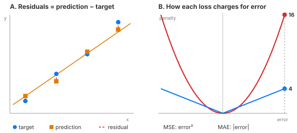

# Day 5 — Loss Functions: How a Model Knows It's Wrong

Tonight you'll be able to: define a loss function, compute MSE and MAE in PyTorch, and explain why a single outlier punishes MSE ~74× harder than MAE.

## The one idea

Every model needs a scorecard. A **loss function** turns "how wrong was I?" into **one number**. Training is just: make that number go down. Everything else — the autograd tape from Day 4, the optimizers in Day 18 — is machinery in service of shrinking this one scalar.

The raw material is the **residual**: prediction minus target, per example. For regression (predicting a number, like tomorrow's close), the two classics are:

```
MSE = mean((pred - target)²)   •   MAE = mean(|pred - target|)
```

Mean squared error. Mean absolute error. That's the whole menu for tonight — and the difference between them is a real modeling decision, not trivia.

Why must a loss be **smooth**? You could score "right vs wrong," but that's a step function — flat everywhere, no slope, no direction. Remember Day 4: autograd replays the tape to produce a **gradient**, a slope saying *which way is downhill*. A loss with no slope starves the whole machine. MSE's parabola gives exactly that: the correction signal `2 × residual / n` — bigger when you're more wrong, zero when you're exactly right.

MSE vs MAE, then, is a choice about how much you fear big misses. **Squaring** punishes large errors disproportionately — one bad print can dominate the entire loss and drag the model toward it. **Absolute value** charges linearly — it shrugs at outliers. Fitting on a tape with one fat-finger print in it? MSE rewrites your whole view around the glitch; MAE barely notices. Pick the loss that matches your beliefs about the noise.

> **Analogy.** A loss function is the model's **SLO error budget**. You don't run reliability as "up vs down" — you quantify: error rate against the SLO, budget burned in basis points. Every deploy and every incident gets scored by that one number, and the whole org optimizes against it. A loss is the same deal: a single scalar everyone (the optimizer) agrees to spend down.
>
> And the differentiability requirement is your alerting rule: a metric with no gradient is like a dashboard with no next action — interesting, but useless for driving decisions. The loss has to *point somewhere*, or training can't act on it.

## See it



*Panel A: residuals between predictions (orange) and targets (blue). Panel B: penalty per unit error — at error 4, MAE charges 4, MSE charges 16.*

## Code it (~30 min)

In your `~/ai-lab` venv on the MacBook, save this as `code.py` (or just run the one in this folder). Toy setup: 4 hourly closes (scaled dollars), our model's guess for each. Compute both losses, inject one spike, then ask autograd (Day 4!) for the gradient — the downhill direction.

```python
import torch

device = torch.device("mps" if torch.backends.mps.is_available() else "cpu")
print(f"Running on: {device}")

target = torch.tensor([2.0, 3.1, 3.9, 5.2], device=device)
pred   = torch.tensor([2.2, 2.8, 4.0, 4.9], device=device)

residual = pred - target          # prediction - target
mse = torch.mean(residual ** 2)
mae = torch.mean(torch.abs(residual))

print("residuals:", [f"{v:.2f}" for v in residual.cpu().tolist()])
print(f"MSE (mean): {mse.item():.4f}   | sum: {torch.sum(residual**2).item():.4f}")
print(f"MAE (mean): {mae.item():.4f}   | sum: {torch.sum(torch.abs(residual)).item():.4f}")

# One outlier: the 4th print spikes to 9.0 (flash print / bad tick)
target_outlier = torch.tensor([2.0, 3.1, 3.9, 9.0], device=device)
r2 = pred - target_outlier
mse2, mae2 = torch.mean(r2 ** 2), torch.mean(torch.abs(r2))
print("--- one outlier: target[3] spikes to 9.0 ---")
print("outlier residuals:", [f"{v:.2f}" for v in r2.cpu().tolist()])
print(f"MSE: {mse2.item():.4f}   MAE: {mae2.item():.4f}")
print(f"One outlier made MSE {(mse2/mse).item():.1f}x bigger, "
      f"MAE only {(mae2/mae).item():.1f}x bigger.")

# Why training can use a loss: it's smooth, so it has a slope
pred_g = pred.clone().requires_grad_(True)
loss = torch.mean((pred_g - target) ** 2)
loss.backward()
print("d(loss)/d(pred):", [f"{v:.2f}" for v in pred_g.grad.cpu().tolist()])
print("The loss has a gradient -> it points downhill. Tomorrow we follow it.")
```

**Expected output:**

```
Running on: mps
residuals: ['0.20', '-0.30', '0.10', '-0.30']
MSE (mean): 0.0575   | sum: 0.2300
MAE (mean): 0.2250   | sum: 0.9000
--- one outlier: target[3] spikes to 9.0 ---
outlier residuals: ['0.20', '-0.30', '0.10', '-4.10']
MSE: 4.2375   MAE: 1.1750
One outlier made MSE 73.7x bigger, MAE only 5.2x bigger.
d(loss)/d(pred): ['0.10', '-0.15', '0.05', '-0.15']
The loss has a gradient -> it points downhill. Tomorrow we follow it.
```

## Today's win

`code.py` runs clean on MPS. You can state in one sentence when you'd pick MAE over MSE (noisy tape, outliers you don't want to chase) — and you watched `loss.backward()` produce a real gradient. That gradient is the raw material for tomorrow.

## Short on time? 20-minute version

Read "The one idea" and study the diagram (5 min). Run `code.py` and look only at the `x bigger` line (10 min). Finish with one sentence: which loss fears outliers, and why? (5 min.)

## Tomorrow's teaser

Tomorrow: gradient descent from scratch — the actual loop that spends the loss down. No framework, just tensors and one update rule.

*Streak: 5 day(s) · Never miss twice.*
