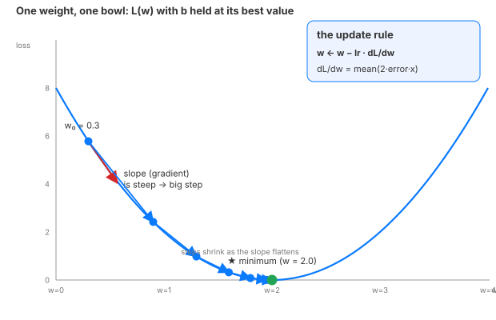

# Day 6 — Gradient Descent From Scratch

**Tonight you'll be able to:** hand-derive the gradient of MSE and watch a five-line loop fit a line to noisy data — no autograd, no framework

## The one idea

Everything you will ever train — a line, an MLP, a frontier LLM — learns the same move: **feel the slope of the loss, step downhill, repeat.** Today you do it with your own two hands, on the simplest model in ML: a line, y = wx + b. Two knobs: the slope `w` and the intercept `b`.

Day 5 gave you the loss — a single number that says how wrong the line is. But the loss can't tell you *which way* to turn the knobs. The **gradient** can. For each knob, the gradient measures the slope of the loss in that knob's direction: "if I nudge `w` up a hair, how fast does the loss change — and in which direction?" Since the slope always points uphill, stepping *against* it always lowers the loss (for a small enough step). Repeat a few hundred times and the knobs settle at the bottom of the bowl. That is learning — the entire field, in one sentence.

**Just-in-time math, one bite:** for MSE the slope has a closed form, and it's worth meeting once:

`dL/dw = mean(2·(wx + b − y)·x)`   `dL/db = mean(2·(wx + b − y))`

In words: each point's error, weighted by its `x`, averaged. File away the shape — **"error times input"** — because this pattern shows up in every gradient you will ever compute.

The only new dial is the **learning rate** — the size of each step. Steep slope → big step, flat slope → small step, automatically. But if the rate itself is too big, you leap across the bowl and diverge; too small and you crawl. You'll see both in the code. Watching the loss curve while training is the first observability habit of ML — your dashboards instinct, applied to a new metric.

## Analogy

This is a **closed-loop controller** — the same shape as a PID loop or TCP congestion control. Measure the error (loss). Compute a correction proportional to the slope (gradient). Apply it (step). Re-measure. A distributed-systems cousin: a load balancer's feedback loop that shifts traffic toward the least-loaded replica based on measured queue depth — the gradient is "which direction reduces the pain," the learning rate is the fraction of traffic you shift per round.

Trading version: it's calibrating a strategy parameter against a backtest — tweak, measure P&L, tweak again — except the gradient hands you the tweak *direction* instead of blind search.

## See it



*One weight, one bowl-shaped loss curve (b held at its best value). Each blue step moves w opposite the slope, scaled by the learning rate; steps shrink as the slope flattens. Red arrow: the gradient — the slope you're pushing against.*

## Code it (~30 min)

Pure Python, no torch — *you* are the autograd today. Data: 100 noisy points drawn from `y = 2x + 1`. Knobs start at `w = 0, b = 0`. Each epoch: predict (forward), score with MSE (loss), compute the two hand-derived gradients (backward), nudge both knobs downhill (step). Then we rerun the same loop with `lr = 1.5` to watch it explode.

Run: `python3 code.py` (any Python 3.11+; no dependencies)

```python
"""Day 6 — Gradient Descent From Scratch: tiny linear regression, no framework.

One idea: gradient descent = feel the slope of the loss, step downhill, repeat.
No torch.autograd today — we hand-derive dL/dw and dL/db for MSE and write the
loop ourselves. This loop (forward -> loss -> backward -> step) is the ancestor
of every training loop in deep learning.

Runs on any MacBook Python 3.11+; no torch, no numpy, no paid APIs.
"""

import random

# --- Toy data: y = 2x + 1 plus noise (Day 5's loss on Day 6's data) ---
random.seed(42)
xs = [random.uniform(-2, 2) for _ in range(100)]
ys = [2 * x + 1 + random.gauss(0, 0.5) for x in xs]
n = len(xs)


def mse(w, b):
    return sum((w * x + b - y) ** 2 for x, y in zip(xs, ys)) / n


# --- Gradient descent, hand-rolled ---
w, b = 0.0, 0.0   # the knobs, initialized at zero
lr = 0.1          # learning rate: step size

print("=== Gradient descent, lr = 0.1 ===")
for epoch in range(100):
    # forward: predictions + loss (Day 5)
    preds = [w * x + b for x in xs]
    loss = sum((p - y) ** 2 for p, y in zip(preds, ys)) / n
    # backward: hand-derived gradients of MSE. Note the shape:
    #   dw = mean(2 * error * x)   ->  "error x input"
    #   db = mean(2 * error)
    dw = sum(2 * (p - y) * x for p, y, x in zip(preds, ys, xs)) / n
    db = sum(2 * (p - y) for p, y in zip(preds, ys)) / n
    # step: move opposite the slope (downhill)
    w -= lr * dw
    b -= lr * db
    if epoch % 20 == 0:
        print(f"epoch {epoch:3d}  loss={loss:.4f}  w={w:.3f}  b={b:.3f}")

print(f"\nlearned: w={w:.3f} b={b:.3f}   (truth: w=2.000 b=1.000)")
print(f"final MSE: {mse(w, b):.4f}")

# --- The same loop with a learning rate that's way too big ---
print("\n=== Gradient descent, lr = 1.5 (too big) ===")
w, b = 0.0, 0.0
for epoch in range(8):
    preds = [w * x + b for x in xs]
    loss = sum((p - y) ** 2 for p, y in zip(preds, ys)) / n
    dw = sum(2 * (p - y) * x for p, y, x in zip(preds, ys, xs)) / n
    db = sum(2 * (p - y) for p, y in zip(preds, ys)) / n
    w -= 1.5 * dw
    b -= 1.5 * db
    print(f"epoch {epoch}: loss={loss:15.2f}  w={w:12.2f}  b={b:12.2f}")
print("\nOvershoots the bowl, oscillates, and blows up. "
      "Step size is the one knob you must respect.")
```

**Expected output:**

```
=== Gradient descent, lr = 0.1 ===
epoch   0  loss=6.8585  w=0.549  b=0.185
epoch  20  loss=0.2281  w=2.043  b=1.077
epoch  40  loss=0.2278  w=2.047  b=1.091
epoch  60  loss=0.2278  w=2.047  b=1.091
epoch  80  loss=0.2278  w=2.047  b=1.091

learned: w=2.047 b=1.091   (truth: w=2.000 b=1.000)
final MSE: 0.2278

=== Gradient descent, lr = 1.5 (too big) ===
epoch 0: loss=           6.86  w=        8.24  b=        2.77
epoch 1: loss=          54.47  w=      -17.08  b=       -0.75
epoch 2: loss=         504.79  w=       61.96  b=        0.08
epoch 3: loss=        4983.73  w=     -187.27  b=       17.80
epoch 4: loss=       50441.22  w=      603.54  b=      -78.73
epoch 5: loss=      515368.75  w=    -1915.57  b=      308.20
epoch 6: loss=     5284281.14  w=     6128.53  b=    -1083.27
epoch 7: loss=    54253104.71  w=   -19596.37  b=     3671.84

Overshoots the bowl, oscillates, and blows up. Step size is the one knob you must respect.
```

## Today's win

Your hand-written loop drove MSE from **6.86 → 0.23** and landed at **w ≈ 2.05, b ≈ 1.09** — against truth `w = 2.0, b = 1.0` — using gradients you derived yourself. No torch, no autograd. The loop you just wrote (*forward → loss → backward → step*) is the ancestor of every training loop in deep learning. You now know what's underneath all of them.

## Short on time? 20-minute version

Read "The one idea," then run `code.py` and watch two things: the loss dropping every epoch, and the `lr = 1.5` run exploding. Skip the math paragraph if you're rushed — the loop is the lesson.

## Tomorrow's teaser

Tomorrow the machine takes over the derivatives: `torch.autograd` replays today's exact loop as **forward → loss → backward → step** — the four-line ritual that trains everything from MLPs to frontier LLMs. You'll never hand-derive a gradient again, and now you'll know exactly what it's doing.

*Streak: 6 day(s) · Never miss twice.*
