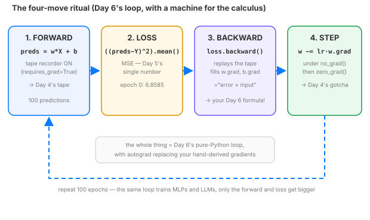

# Day 7 — The Training Loop Anatomy

**Tonight you'll be able to:** run the four-move ritual — forward → loss → backward → step — that trains every PyTorch model, and watch it land on the exact answer you hand-derived yesterday.

## The one idea

Yesterday *you* were the autograd: you derived the gradients by hand and wrote the loop. Today torch does the calculus — and you'll see that **the loop you wrote *is* the training loop**. Every model you will ever train — a line, an MLP, a frontier LLM — learns through the same four moves:

**1. Forward.** `preds = w * X + b`. Because `w` and `b` were created with `requires_grad=True`, torch silently starts the tape recorder (Day 4) on every op. **2. Loss.** `loss = ((preds - Y) ** 2).mean()` — Day 5's MSE collapses all predictions to one number. **3. Backward.** `loss.backward()` replays the tape and fills `w.grad` and `b.grad` with exactly the "error times input" formula you derived yesterday. Nothing new — a machine for your calculus. **4. Step.** `w -= lr * w.grad`. Ordinary arithmetic on the knobs, same as Day 6.

Two bookkeeping details make it real: the step runs under `with torch.no_grad()` so the bookkeeping itself isn't recorded on the tape (you don't want "nudging the knob" to become part of the gradient's story), and `w.grad.zero_()` resets the accumulator because gradients *add up* across backward calls (Day 4's accumulation) — forgetting this is the classic silent training bug.

The payoff: when you read any PyTorch training code from now on — tutorials, papers, frontier repos — you won't see four mysteries. You'll see *this*, with a bigger forward and a fancier loss.

> **Analogy:** This is a **Kubernetes reconcile loop** in four phases: observe the current state (forward), diff it against desired (loss), attribute the diff to each component (backward — "which knob caused this?"), apply the patch (step), then re-observe. The backward pass is the attribution engine — it's the `kubectl describe` that turns "the SLO is breached" into "this deployment's replica count is the lever." In trading terms: scan (forward) → score the signal (loss) → risk engine says which position is bleeding (backward) → send the order (step).

## See it



*The four-move ritual. The loop-back arrow is the whole lesson: every PyTorch training run, at any scale, is forward → loss → backward → step, repeated.*

## Code it (~30 min)

Same data, same model, same loop as yesterday — but `requires_grad=True` turns on Day 4's tape recorder, and `loss.backward()` computes the gradients you hand-derived. First we hold autograd against your formula at epoch 0; then we run the loop and compare the final answer to yesterday's.

```python
"""Day 7 — The Training Loop: forward → loss → backward → step.

One idea: every training loop in PyTorch (and in deep learning, period) is
four moves: forward (make predictions) → loss (score them) → backward (get
gradients) → step (nudge the knobs downhill). Today we replay Day 6's tiny
regression in torch, and let autograd replace the hand-derived gradients.

Runs on a MacBook with the ~/ai-lab venv + torch (MPS or CPU). No CUDA, no paid APIs.
"""

import random

import torch

random.seed(42)  # same toy data as Day 6

# --- Data: y = 2x + 1 plus noise (100 points) ---
xs = [random.uniform(-2, 2) for _ in range(100)]
ys = [2 * x + 1 + random.gauss(0, 0.5) for x in xs]
n = len(xs)

device = "mps" if torch.backends.mps.is_available() else "cpu"
print(f"device: {device}")
X = torch.tensor(xs, dtype=torch.float32, device=device)
Y = torch.tensor(ys, dtype=torch.float32, device=device)

# --- The knobs, but this time torch watches them (Day 4's tape recorder) ---
w = torch.tensor(0.0, requires_grad=True, device=device)
b = torch.tensor(0.0, requires_grad=True, device=device)
lr = 0.1

# --- Side by side at epoch 0: yesterday's formula vs autograd ---
preds0 = [w.item() * x + b.item() for x in xs]  # w=0, b=0
dw_hand = sum(2 * (p - y) * x for p, y, x in zip(preds0, ys, xs)) / n
db_hand = sum(2 * (p - y) for p, y in zip(preds0, ys)) / n

preds_t = w * X + b
torch_loss0 = ((preds_t - Y) ** 2).mean()
torch_loss0.backward()
print(f"hand-derived grads: dw={dw_hand:.5f}  db={db_hand:.5f}")
print(f"autograd grads:     dw={w.grad.item():.5f}  db={b.grad.item():.5f}")
w.grad.zero_()
b.grad.zero_()

# --- The loop: forward → loss → backward → step ---
print("\nepoch   loss     w       b")
for epoch in range(100):
    preds = w * X + b                      # forward: predictions
    loss = ((preds - Y) ** 2).mean()       # loss: one number
    loss.backward()                        # backward: fills w.grad, b.grad
    with torch.no_grad():                  # step: bookkeeping, don't record it
        w -= lr * w.grad
        b -= lr * b.grad
    w.grad.zero_()                         # reset the tape for next epoch
    b.grad.zero_()
    if epoch % 20 == 0:
        print(f"{epoch:3d}   {loss.item():.4f}  {w.item():.3f}  {b.item():.3f}")

print(f"\nlearned: w={w.item():.3f}  b={b.item():.3f}   (truth: 2.000 / 1.000)")
print("Day 6's pure-Python loop converged to w=2.047, b=1.091. Same loop. Same math.")
```

**Expected output:**

```
device: mps
hand-derived grads: dw=-5.49342  db=-1.84714
autograd grads:     dw=-5.49342  db=-1.84714

epoch   loss     w       b
  0   6.8585  0.549  0.185
 20   0.2281  2.043  1.077
 40   0.2278  2.047  1.091
 60   0.2278  2.047  1.091
 80   0.2278  2.047  1.091

learned: w=2.047  b=1.091   (truth: 2.000 / 1.000)
Day 6's pure-Python loop converged to w=2.047, b=1.091. Same loop. Same math.
```

## Today's win

Autograd's gradients matched your hand-derived ones digit for digit — the machine replays your calculus exactly — and the torch loop converged to **w=2.047, b=1.091**, byte-identical to yesterday's pure-Python answer. You can now read the training loop in any PyTorch codebase on earth: it's these four moves, with a bigger forward. Experiment: comment out the two `zero_grad()` lines and re-run — watch the accumulation bug from Day 4 bite.

## Short on time? 20-minute version

Read "The one idea," then run `code.py` and watch two numbers: the epoch-0 gradients matching your formula, and the loss collapsing 6.86 → 0.23. Skip the no_grad/zero_grad paragraph tonight — the four moves are the lesson. (~20 min)

## Tomorrow's teaser

Tomorrow: a model that aces its training data can still be useless on data it hasn't seen. The curve-fitting trap — and its trading cousin, the backtest that memorized the past.

---
*Streak: 7 day(s) · Never miss twice.*
