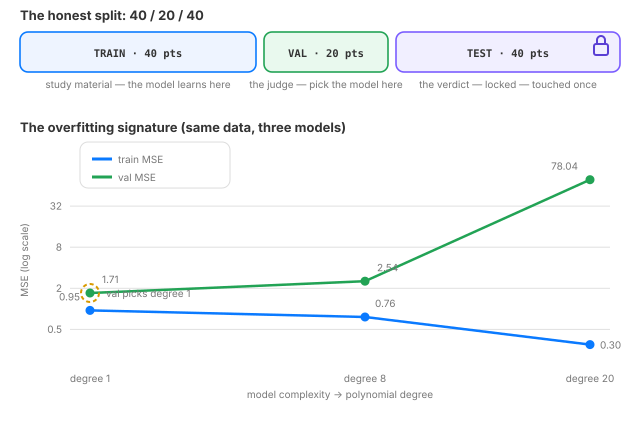

# Day 8 — Train, Val, Test & Overfitting

*Tonight you'll be able to: split any dataset the honest way, read the overfitting signature in two numbers, and never leak a test set again.*

## The one idea

Days 6 and 7 fit one line on all 100 points and then graded it on the same 100 points. That is the student grading their own homework — rigged. A model that memorizes the training data gets an A+ from training loss and an F from reality. So we split the data into three piles with three jobs:

- **TRAIN** — the study material. The model learns here; every knob is tuned against this pile. 40 points tonight.
- **VAL** (validation) — the judge. You pick the model, the hyperparameters, the checkpoint here. The model never trains on it; it only gets graded on it. 20 points.
- **TEST** — the verdict. Locked away, touched *exactly once*, at the very end, to report the one honest number. 40 points.

**Overfitting** is what happens when a model has more knobs than the training data deserves. A degree-20 polynomial has 21 knobs for 40 noisy points — about two points per knob. It can thread every training point, so its train MSE collapses to 0.30. But it memorized the *noise*, not the line, and on fresh data it flails: val MSE 78.04. The signature, learn to read it at a glance: **train loss keeps falling while val loss bottoms out and rises**. Train ≪ val = memorization, not learning.

The cardinal sin is tuning against the test set. Every choice you make while looking at test scores leaks the answer key into training — you end up "passing the exam" by studying the exam itself. That is why there are *three* piles, not two: val absorbs all your decisions, test stays clean.

No new math tonight — MSE is Day 5's, and the intuition is pure counting: 21 knobs vs 40 noisy points leaves nothing left to generalize with.

## Analogy

**The runbook engineer.** An on-call engineer who memorizes every past incident's runbook aces the quiz on old incidents (train MSE → 0) — then freezes on the novel 3am page she's never seen (val explodes). Understanding generalizes; memorization overfits. You already interview for the difference between the two.

**Curve-fitting a backtest.** Add enough indicators to a strategy and you can make it print money on 2021–2023 data — beautiful equity curve, train MSE near zero. Then you trade it live and it bleeds, because the market, like the test set, doesn't care about your backtest. You live this one, Sai. The quant capstone (Days 83–92) will formalize it: walk-forward validation is just train/val/test with a calendar.

## See it



Top: the 40/20/40 split and each pile's job. Bottom: MSE (log scale) vs model complexity on the same data — train MSE falls with more knobs while val MSE bottoms out and explodes. The dashed circle marks where val picks the model.

## Code it (~30 min)

Same toy world as Days 6/7 (`y = 2x + 1 + noise`, seed 42 — the data is generated in pure Python so your numbers match the expected output exactly), noisier this time (σ = 1.0), split 40/20/40 with `random.shuffle` *before* splitting — order is information. Three models of growing flexibility, fit with exact least squares (`torch.linalg.lstsq`), graded on all three piles. Watch the signature.

```python
"""Day 8 — Train/Val/Test & Overfitting: the generalization contract.

One idea: training loss is a grade the student gives themselves — rigged.
You need three piles: TRAIN (study material), VAL (the judge you tune
against), TEST (the verdict — locked away, touched once). Tonight we fit
three models of growing flexibility on the same toy world as Days 6/7 and
watch the overfit model's train loss collapse while its honest loss explodes.

Runs on a MacBook with the ~/ai-lab venv + torch (MPS or CPU). No CUDA, no paid APIs.
"""

import random

import torch

random.seed(42)  # same toy world as Days 6/7, noisier this time

# --- Data: y = 2x + 1 + noise (100 points), then the honest 40/20/40 split ---
xs = [random.uniform(-2, 2) for _ in range(100)]
ys = [2 * x + 1 + random.gauss(0, 1.0) for x in xs]
idx = list(range(100))
random.shuffle(idx)  # shuffle BEFORE splitting — order is information

device = "mps" if torch.backends.mps.is_available() else "cpu"
print(f"device: {device}")
X = torch.tensor(xs, dtype=torch.float32, device=device)
Y = torch.tensor(ys, dtype=torch.float32, device=device)

Xtr, Ytr = X[idx[:40]], Y[idx[:40]]      # TRAIN: the study material
Xva, Yva = X[idx[40:60]], Y[idx[40:60]]  # VAL: the judge (pick the model here)
Xte, Yte = X[idx[60:]], Y[idx[60:]]      # TEST: the verdict — touched once, below


def design(xv, degree):
    """Polynomial features x, x^2, ..., x^degree + bias, standardized."""
    feats = torch.stack([xv ** p for p in range(1, degree + 1)], dim=1)
    z = (feats - feats.mean(0)) / feats.std(0, unbiased=False)
    return torch.cat([torch.ones(len(xv), 1, device=device), z], dim=1)


def fit_and_score(degree):
    beta, *_ = torch.linalg.lstsq(design(Xtr, degree), Ytr.unsqueeze(1))
    beta = beta.squeeze(1)  # exact least squares — no gradient descent
    mse = lambda a, b: ((a - b) ** 2).mean().item()
    return (mse(design(Xtr, degree) @ beta, Ytr),
            mse(design(Xva, degree) @ beta, Yva),
            mse(design(Xte, degree) @ beta, Yte))


print(f"\n{'model':<12}{'train':>8}{'val':>8}{'test':>8}")
results = {}
for deg in (1, 8, 20):
    tr, va, te = fit_and_score(deg)
    results[deg] = (tr, va, te)
    print(f"degree {deg:<4}{tr:>8.2f}{va:>8.2f}{te:>8.2f}")

best = min(results, key=lambda d: results[d][1])
print(f"\nval picks degree {best}  (val MSE {results[best][1]:.2f} — the honest score)")
print(f"test verdict: degree {best} MSE {results[best][2]:.2f} "
      f"vs degree 20 MSE {results[20][2]:.2f}  <-- overfitting, quantified")
print("\nthe test set was touched exactly once: right here, at the end.")```

**Expected output:**

```
device: mps              (prints "cpu" on machines without MPS)

model       train     val    test
degree 1     0.95    1.71    1.69
degree 8     0.76    2.54    2.11
degree 20    0.30   78.04   33.49

val picks degree 1  (val MSE 1.71 — the honest score)
test verdict: degree 1 MSE 1.69 vs degree 20 MSE 33.49  <-- overfitting, quantified

the test set was touched exactly once: right here, at the end.
```

## Today's win

Run the script in `~/ai-lab`. The degree-20 model *wins* training (MSE 0.30) and loses reality (val 78.04 — about 46× worse than the honest model). Val picks degree 1 *before you ever look at test*; the single test peek confirms it (1.69 vs 33.49). Done-state: you can explain why nobody tunes on test, and you can read `train ≪ val` as memorization in any loss table — including, one day, your own trading models.

## Short on time? 20-minute version

Read "The one idea" and the analogy, run the code, stare at the three-row table for a minute. The whole lesson is one signature: train falls, val explodes. Fifteen minutes, one concept, show up tomorrow.

## Tomorrow's teaser

Tomorrow: we take this machinery to the real world — fitting a line to actual SPY closes. Your world, honest splits, real noise.

---
*Streak: 8 day(s) · Never miss twice.*
