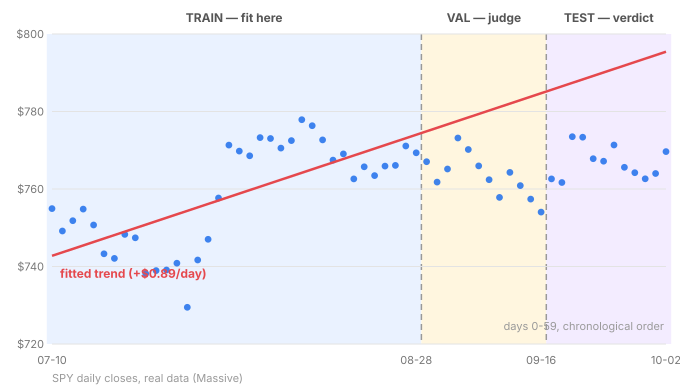

# Day 9 — Fit a Line to Real Data

**Tonight you'll be able to:** run the whole Phase A machine — tensors → autograd → MSE → gradient descent → train/val/test — on 60 days of real SPY closes, and read the report card like an engineer.

## The one idea

Days 2–8 built you a complete machine. Tonight you point it at the real world. Here's the whole arc in one breath:

- **Days 2–3:** market data lives in tensors; every op is vectorized.
- **Day 4:** autograd tapes the computation so gradients replay themselves.
- **Day 5:** MSE turns "wrong" into a single number the machine can minimize.
- **Days 6–7:** gradient descent plus the four-phase loop (forward → loss → backward → step) finds the line.
- **Day 8:** the three piles — train fits, val judges, test delivers the verdict.

One new rule tonight, and it's the difference between a backtest that lies and one that doesn't: **the split must respect time.** With time series, shuffling is forbidden — it leaks the future into training. Days 0–35 train, 36–47 validate, 48–59 test. That ordering is a contract, not a preference.

Two just-in-time bites, both load-bearing:

**1. Normalize with train stats only.** Day index runs 0–59 while prices sit near $750 — different scales make the loss bowl long and skinny, and Day 6 taught you what that does to a learning rate. So we z-score the day index, `(x − mean) / std`, using the *train* mean and std for all three piles. Peeking at val/test to build the scaler is leakage — the polite kind, the kind that still ruins you.

**2. R², the honest score.** `R² = 1 − SS_res / SS_tot`: the fraction of price variance your line explains. 1.0 is perfect, 0.0 means "no better than predicting the average price every day," and *negative* means worse than the average — the model is actively misleading you. Watch what happens below.

## Analogy

You've done this before — in two worlds. **Capacity planning:** you fit a request-growth trend to production traffic logs, then validate against *next month's* traffic — never against shuffled past days, because next month is the only exam that counts. **Trading:** backtest on 2024, validate on 2025, paper-trade 2026. Shuffling the days would be trading on tomorrow's newspaper.

The red line below is exactly that fit: a July trend projected into September and October. It overshoots — the regime changed. That overshoot has a name you'll meet properly on Day 83: *non-stationarity*, the reason finance is the hardest ML domain there is.

## See it



*Train on days 0–35, judge on 36–47, verdict on 48–59 — note how the July trend sails above the September–October dots: one regime's trend doesn't survive the next.*

## Code it (~30 min)

60 real SPY daily closes (2026-07-10 → 2026-10-02, pulled from your Massive feed), embedded as data — no downloads, no APIs, nothing to install. Paste into `~/ai-lab` and run:

```python
"""Day 9 - Fit a Line to Real Data: the Phase A machine, end to end.

Recap arc: tensors hold the data (Day 2), vectorized ops (Day 3),
autograd tapes the computation (Day 4), MSE scores the error (Day 5),
gradient descent + the 4-phase training loop find w and b (Days 6-7),
chronological train/val/test splits judge generalization (Day 8).

Runs on MacBook: ~/ai-lab venv, torch CPU/MPS. No downloads, no paid APIs -
60 real SPY daily closes (2026-07-10 -> 2026-10-02, via Massive) are embedded.
"""
import torch

DATES = [
    '2026-07-10', '2026-07-13', '2026-07-14', '2026-07-15', '2026-07-16', '2026-07-17',
    '2026-07-20', '2026-07-21', '2026-07-22', '2026-07-23', '2026-07-24', '2026-07-27',
    '2026-07-28', '2026-07-29', '2026-07-30', '2026-07-31', '2026-08-03', '2026-08-04',
    '2026-08-05', '2026-08-06', '2026-08-07', '2026-08-10', '2026-08-11', '2026-08-12',
    '2026-08-13', '2026-08-14', '2026-08-17', '2026-08-18', '2026-08-19', '2026-08-20',
    '2026-08-21', '2026-08-24', '2026-08-25', '2026-08-26', '2026-08-27', '2026-08-28',
    '2026-08-31', '2026-09-01', '2026-09-02', '2026-09-03', '2026-09-04', '2026-09-08',
    '2026-09-09', '2026-09-10', '2026-09-11', '2026-09-14', '2026-09-15', '2026-09-16',
    '2026-09-17', '2026-09-18', '2026-09-21', '2026-09-22', '2026-09-23', '2026-09-24',
    '2026-09-25', '2026-09-28', '2026-09-29', '2026-09-30', '2026-10-01', '2026-10-02'
]

CLOSES = [
    754.95, 749.17, 751.83, 754.81, 750.72, 743.29, 742.09, 748.28, 747.41, 738.18, 738.93, 739.09,
    740.86, 729.46, 741.69, 747.03, 757.67, 771.33, 769.79, 768.56, 773.26, 773.03, 770.56, 772.49,
    777.88, 776.34, 772.67, 767.45, 769.06, 762.60, 765.72, 763.47, 765.91, 766.08, 771.10, 769.35,
    767.05, 761.78, 765.16, 773.17, 770.19, 765.96, 762.40, 757.83, 764.29, 760.88, 757.39, 754.05,
    762.60, 761.69, 773.50, 773.38, 767.81, 767.18, 771.35, 765.61, 764.20, 762.63, 763.99, 769.64
]

closes = torch.tensor(CLOSES, dtype=torch.float32)
x = torch.arange(len(closes), dtype=torch.float32)  # day index 0..59

# ---- Chronological split: with time series the piles must respect time ----
# Shuffling here = look-ahead bias = trading on data from the future.
n_train, n_val = 36, 12
x_train, y_train = x[:n_train], closes[:n_train]
x_val, y_val = x[n_train:n_train + n_val], closes[n_train:n_train + n_val]
x_test, y_test = x[n_train + n_val:], closes[n_train + n_val:]

# ---- z-score normalize using TRAIN stats only (never peek at val/test) ----
x_mean, x_std = x_train.mean(), x_train.std()
xn_train = (x_train - x_mean) / x_std
xn_val = (x_val - x_mean) / x_std
xn_test = (x_test - x_mean) / x_std

# ---- Days 6/7 machinery: linear model + MSE, fit by gradient descent ----
w = torch.zeros(1, requires_grad=True)
b = torch.zeros(1, requires_grad=True)
opt = torch.optim.SGD([w, b], lr=0.1)
for _ in range(500):
    loss = ((w * xn_train + b - y_train) ** 2).mean()  # MSE (Day 5)
    opt.zero_grad()   # no_grad/zero_grad bookkeeping (Day 7 gotcha)
    loss.backward()   # autograd replays the tape (Day 4)
    opt.step()        # walk the bowl (Day 6)

# ---- Report card ----
with torch.no_grad():
    for name, xn, y in (("train", xn_train, y_train),
                        ("val", xn_val, y_val),
                        ("test", xn_test, y_test)):
        pred = w * xn + b
        mse = ((pred - y) ** 2).mean().item()
        r2 = 1 - ((pred - y) ** 2).sum().item() / ((y - y.mean()) ** 2).sum().item()
        print(f"{name:5s}  MSE {mse:7.2f}   RMSE ${mse ** 0.5:5.2f}   R2 {r2:6.3f}")

slope = (w / x_std).item()  # back into $/day
print(f"\ntrend slope: ${slope:+.2f} per trading day")
print(f"model price at day 0: ${b.item():.2f}")
print(f"last real close: ${CLOSES[-1]:.2f}")
print("\nlast 3 test days: model vs actual")
with torch.no_grad():
    for j in range(len(x_test) - 3, len(x_test)):
        day = int(x_test[j].item())
        pred = (w * xn_test[j] + b).item()
        print(f"{DATES[day]}  model ${pred:7.2f}   actual ${CLOSES[day]:7.2f}")
```

**Expected output:**

```
train  MSE   92.33   RMSE $ 9.61   R2  0.482
val    MSE  330.42   RMSE $18.18   R2 -11.021
test   MSE  583.00   RMSE $24.15   R2 -34.876

trend slope: $+0.89 per trading day
model price at day 0: $742.77
last real close: $769.64

last 3 test days: model vs actual
2026-09-30  model $ 793.65   actual $ 762.63
2026-10-01  model $ 794.55   actual $ 763.99
2026-10-02  model $ 795.44   actual $ 769.64
```

Spoiler: after 500 epochs the loop lands on exactly the closed-form answer — the gradient walk and the algebra agree.

## Today's win

**Done-state:** you ran the entire Phase A machine on real market data — 60 SPY closes, chronological 36/12/12 split, z-scored features, 500 epochs of the Day-6/7 loop — and it converged to the exact closed-form trend line: **+$0.89 per trading day**.

The honest part is the report card: train R² 0.48, test R² *negative*. The line fit July beautifully and got embarrassed by September — a trend from one regime projected into another. That's not a failure of your pipeline; it's what the pipeline is *for*: telling you the truth about generalization before real money is involved.

## Short on time? 20-minute version

Run `code.py` and read the report card — 5 minutes. Then change `n_train = 36` to `48` and re-run: watch how the test RMSE moves as the train window eats more of the sideways market. That's the whole lesson in miniature: **where you cut time changes what the model believes.**

## Tomorrow's teaser

Tomorrow: the vocabulary AI scientists actually speak — distributions. Normal, categorical, and why "assume it's Gaussian" is doing more work than it looks.

---

Streak: 9 day(s) · Never miss twice.
