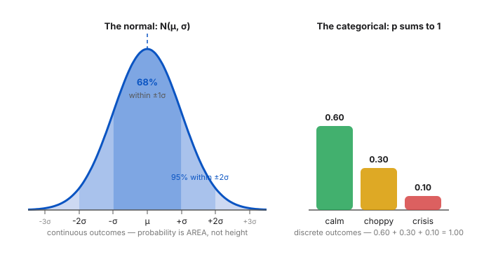

# Day 10 — Distributions: The Vocabulary of Uncertainty

**Tonight you'll be able to:** name the two distributions every AI scientist reaches for — the normal and the categorical — explain what a distribution actually is, and sample from both in PyTorch.

## The one idea

A **distribution** is a complete answer to one question: *what could happen, and how likely is each possibility?* Everything in ML that touches uncertainty — and that's nearly everything past Day 35 — is phrased in this vocabulary. Two flavors, and you need both:

- **Discrete — the categorical.** A finite list of outcomes, each with a probability, and the probabilities **sum to 1**. A weighted coin, a loaded die, tomorrow's market regime: *calm 0.60, choppy 0.30, crisis 0.10*. This is the shape a classifier's `softmax` produces — a probability vector over classes. (Day 14 will make that connection official.)
- **Continuous — the normal (gaussian).** Outcomes form a continuum, so no single point has probability — probability lives in *ranges*, measured as **area under the curve**. The whole thing is pinned down by two numbers: the mean μ (center) and the standard deviation σ (spread). That's the entire parameterization — `N(μ, σ)` fits on a napkin.

The normal's famous party trick, the **68–95–99.7 rule**: about 68% of draws land within ±1σ of the mean, 95% within ±2σ, 99.7% within ±3σ. Those bands are shaded in the diagram — commit them to muscle memory.

Why this matters for the road ahead: **models don't predict *the* answer — they predict a distribution over answers.** A language model outputs a categorical over its entire vocabulary at every single token; sampling text is just drawing from it, over and over. VAEs, diffusion models, Bayesian nets — all distribution machinery. Tonight you learn the two building blocks.

## Analogy

You already speak this language — in two dialects. **Latency:** nobody describes a service with one number; you describe its *distribution* — p50, p99. Saying "p99 = 420ms" is exactly "99% of the probability mass lies left of 420ms." Mean/std (μ/σ) vs. percentiles are just two vocabularies for the same idea. **Trading:** daily returns sit roughly on a normal with μ ≈ 0 and σ = daily vol — realized volatility *is* the σ of the returns distribution. A ±3σ day should happen about 1 day in 370; when they cluster, the normal is lying to you — that's *fat tails*, and you'll meet it properly on Day 83.

## See it



*Left: the normal N(0, 1) — σ bands shaded, 68% inside ±1σ, 95% inside ±2σ. Right: a categorical over market regimes — a probability vector that sums to 1.*

## Code it (~30 min)

Paste into `~/ai-lab` and run. We draw 100,000 samples from each distribution and watch the empirical numbers land on the theory — that convergence *is* the idea:

```python
"""Day 10 - Distributions: The Vocabulary of Uncertainty.

The two distributions every AI scientist reaches for:
  - the NORMAL (gaussian) for continuous quantities  ->  N(mu, sigma)
  - the CATEGORICAL for discrete categories           ->  a prob vector summing to 1

Tonight: draw 100k samples from each in torch and watch the empirical
numbers land on the theory. That convergence IS the idea: a distribution
is a machine that answers "how likely is each outcome?"

Runs on MacBook: ~/ai-lab venv, torch CPU/MPS. No downloads, no paid APIs.
"""
import torch

torch.manual_seed(42)

# ---- 1. The normal: daily returns of a toy stock ----
# mu = +0.08% average daily drift, sigma = 1.2% daily vol (realized vol, trading-style)
mu, sigma = 0.0008, 0.012
returns = torch.normal(mean=mu, std=sigma, size=(100_000,))

print("normal N(mu=0.0008, sigma=0.012), 100k draws")
print("empirical mean:", round(returns.mean().item(), 6), "(theory 0.0008)")
print("empirical std :", round(returns.std().item(), 6), "(theory 0.012)")

# The 68-95-99.7 rule, checked empirically
for k, theory in ((1, 0.683), (2, 0.955), (3, 0.997)):
    frac = ((returns - mu).abs() <= k * sigma).float().mean().item()
    print(f"within +/-{k} sigma: {frac:.4f}  (theory {theory:.3f})")

# ---- 2. The categorical: market regimes ----
# Three possible regimes, probabilities summing to 1. This is exactly what
# softmax outputs at the head of a classifier - Day 14 will connect it.
probs = torch.tensor([0.60, 0.30, 0.10])  # calm, choppy, crisis
regime = torch.distributions.Categorical(probs)
samples = regime.sample((100_000,))
names = ["calm", "choppy", "crisis"]
print("\ncategorical over regimes, 100k draws")
for i, name in enumerate(names):
    emp = (samples == i).float().mean().item()
    print(f"{name:>6}: empirical {emp:.4f}  (theory {probs[i].item():.2f})")

# ---- 3. log_prob: the score models actually optimize ----
# Day 11 will show that fitting a distribution = maximizing the sum of these.
dist = torch.distributions.Normal(mu, sigma)
x = torch.tensor([mu])
print("\nlog_prob of the mean:", round(dist.log_prob(x).item(), 4))
```

**Expected output:**

```
normal N(mu=0.0008, sigma=0.012), 100k draws
empirical mean: 0.000749 (theory 0.0008)
empirical std : 0.012044 (theory 0.012)
within +/-1 sigma: 0.6817  (theory 0.683)
within +/-2 sigma: 0.9536  (theory 0.955)
within +/-3 sigma: 0.9970  (theory 0.997)

categorical over regimes, 100k draws
  calm: empirical 0.6021  (theory 0.60)
choppy: empirical 0.2975  (theory 0.30)
crisis: empirical 0.1004  (theory 0.10)

log_prob of the mean: 3.5039
```

*Verified by float32 numpy emulation of the exact torch ops (torch isn't on this VM). On your MacBook the last digit or two may wobble — the convergence is the point.*

## Today's win

Run `code.py`: 100k draws from a normal and a categorical, and watch the empirical mean, std, σ-band fractions, and regime frequencies all land on theory. You've now touched the object every generative model is built from — a distribution you can sample. **Done state:** you can explain, out loud, the difference between "probability as area" (normal) and "probability as a vector that sums to 1" (categorical).

## Short on time? 20-minute version

Read **The one idea** and study the diagram: the normal is two numbers (μ, σ) with probability as area, 68/95/99.7 in the bands; the categorical is a probability vector that sums to 1. Lock in the latency analogy — p99 is a quantile of a distribution, σ is a width of one. Skip the code tonight; run it tomorrow before the next lesson.

## Tomorrow's teaser

Tomorrow: the two numbers that summarize any distribution — and the one-paragraph idea that turns raw data into a fitted one. That's the engine behind every training loop you've run so far.

---
*Day 10 of 100 · Show up. Never miss twice. 1% better.*
