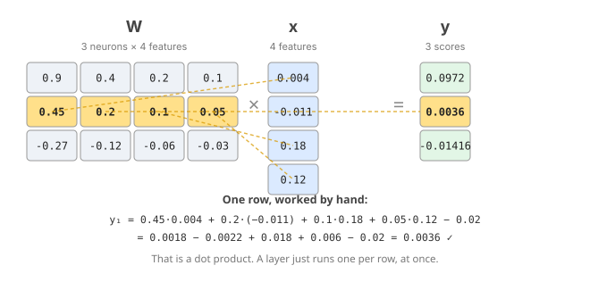

# Day 12 — Vectors, Dot Products & the Core Op

**Tonight you'll be able to:** say what a dot product, a matrix multiply, and the shape contract are — and show that a neural layer is just `y = Wx + b`.

## The one idea

You've been running the core op of deep learning since Day 6 — you just didn't have the name for it yet.

**A vector** is an ordered list of numbers. Tonight it's 4 features of one stock-day: `[ret_1d, ret_5d, log(volume/vol_20d), RSI−50]`. The order is the meaning; position 3 is always the volume signal.

**A dot product** is multiply-pairs-then-add: `w·x = Σ wᵢxᵢ`. It takes two vectors and returns one number. Every weighted average you've ever computed is a dot product. A **neuron** is exactly one dot product plus a bias: `y = w·x + b`. Day 6's `y = 2.0·x + 1.0` was the one-weight special case. Tonight's neuron has 4 weights — same move, wider input.

**A matrix** is a stack of vectors. Stack three neurons' weight rows into a matrix `W` (3 rows × 4 columns), and `Wx` computes *all three* dot products in one shot: `yⱼ = Σᵢ Wⱼᵢxᵢ + bⱼ`. One row, one neuron, one dot product — the matrix is just batched dot products with shared bookkeeping.

**The batch** is where it gets real. Score 5 stock-days at once: stack the feature vectors as rows of `X` (5 × 4), and `X @ W.T` gives all 5 days × 3 neurons = **15 dot products in a single op, zero Python loops**.

**The shape contract.** In `A @ B`, the inner dims must match: `(m,k) @ (k,n) → (m,n)`. (5,4) @ (4,3) works → (5,3). (5,4) @ (3,4) refuses — the `4` and the `3` don't touch. Think of it as the op's type signature: features-out-of-A must equal features-into-B. Nine out of ten "deep learning bugs" you'll ever debug are this rule.

So a neural layer, revealed: `y = Wx + b` — every neuron votes its weighted sum, the matrix runs every vote at once, and the shapes keep everyone honest. Everything from Day 36 onward is built out of this exact line, wrapped in non-linearities.

## Analogy

**Distributed systems:** a matrix multiply is the ultimate fan-out. Every output cell is an independent dot product — no cell needs another cell's result — so the whole op shards perfectly across workers, exactly like a map with no reduce. `W`'s rows are per-worker config read once; `X`'s rows are the workload. Tomorrow you'll see why this property, and only this property, is what GPUs were built for.

**Trading:** portfolio return is *literally* a dot product — `Σ weightᵢ × returnᵢ`. You've been hand-computing them for years. And note tonight's 2× experiment: double the position (features), and the output doubles (bias aside) — dot products are linear, which is exactly why leverage scales P&L linearly. Also why the model needs non-linearities later: linearity alone can't price anything interesting.

## See it



*A 3-neuron layer as one matmul. Row 2 is worked by hand — one dot product; the matrix just runs one per row, at once.*

## Code it (~30 min)

Paste into `~/ai-lab` and run. Four moves: a neuron by hand, a layer as one matmul, a whole watchlist in one batched op, and the shape contract enforced.

```python
"""Day 12 - Linear Algebra Bite 1: Vectors, Dot Products, Matrix Multiply.

Tonight's idea: a neuron is a dot product. A layer is a matrix multiply.
  1. Vector + dot product: a weighted sum. w . x + b is the Day-6 neuron.
  2. Matrix @ vector: every row of W dot-products x in one shot -- one layer.
  3. Matrix @ matrix: add a batch dim, score a whole watchlist at once.
  4. The contract: shapes (m,k) @ (k,n) = (m,n) are the type system.

Runs on MacBook: ~/ai-lab venv, torch CPU/MPS. No downloads, no paid APIs.
"""
import torch

torch.manual_seed(12)

# ---- 1. A neuron is a dot product ----
# Day-6's line y = 2.0*x + 1.0, rewritten: w . x + b with w = [2.0], b = 1.0.
# Trading toy: a next-day score from 4 features
#   [ret_1d, ret_5d, log(volume/volume_20d), RSI-50]
x = torch.tensor([0.004, -0.011, 0.18, 0.12])   # one stock-day's features
w = torch.tensor([0.9, 0.4, 0.2, 0.1])          # weights = opinions on features
b = torch.tensor(0.05)                          # bias = base rate
hand = (w * x).sum() + b                        # multiply pairs, add, shift
print("features x :", [round(v, 4) for v in x.tolist()])
print("weights  w :", [round(v, 4) for v in w.tolist()])
print("by hand (w*x).sum() + b :", round(hand.item(), 6))
print("torch.dot(w, x) + b      :", round((torch.dot(w, x) + b).item(), 6))
print("match:", bool(torch.allclose(hand, torch.dot(w, x) + b)))

# ---- 2. A layer is a matrix multiply ----
# Three neurons = three opinions on the same features. Stack their weight
# rows into W -- one matmul computes all three dot products at once.
W = torch.stack([w, w * 0.5, w * -0.3])         # shape (3, 4)
b2 = torch.tensor([0.05, -0.02, 0.0])           # one bias per neuron
y_loop = torch.stack([torch.dot(row, x) + b2[i] for i, row in enumerate(W)])
y_mat = W @ x + b2                              # (3,4) @ (4,) -> (3,)
print("\nW.shape:", tuple(W.shape), "x.shape:", tuple(x.shape),
      "y.shape:", tuple(y_mat.shape))
print("looped dot products:", [round(v, 6) for v in y_loop.tolist()])
print("W @ x + b          :", [round(v, 6) for v in y_mat.tolist()])
print("match:", bool(torch.allclose(y_loop, y_mat)))

# ---- 3. The batch: score a whole watchlist in one matmul ----
# X rows = examples, columns = features: (5,4) @ (4,3) -> (5,3). Zero loops.
X = torch.stack([x, x * 1.5, x * -0.8, x * 2.0, x * 0.3])
scores_loop = torch.stack([W @ row + b2 for row in X])
scores_mat = X @ W.T + b2                       # (5,4) @ (4,3) -> (5,3)
print("\nX.shape:", tuple(X.shape), "W.T.shape:", tuple(W.T.shape),
      "scores.shape:", tuple(scores_mat.shape))
print("batch loop == one matmul:", bool(torch.allclose(scores_loop, scores_mat)))
print("row 0 (base)      :", [round(v, 6) for v in scores_mat[0].tolist()])
print("row 3 (2x leverage):", [round(v, 6) for v in scores_mat[3].tolist()])
print("2x leverage on features == 2x on scores (b aside):",
      bool(torch.allclose(scores_mat[3] - b2, 2 * (scores_mat[0] - b2))))
n_mult = X.shape[0] * W.shape[0] * X.shape[1]
print("multiplies in one matmul:", n_mult, "(zero Python loops)")

# ---- 4. The contract: shapes are the type system ----
# torch.nn.functional.linear(x, W, b) == x @ W.T + b. Same numbers, cleaner API.
import torch.nn.functional as F
y_f = F.linear(X, W, b2)                        # (5,4) @ (4,3) -> (5,3)
print("\nF.linear(X, W, b) == X @ W.T + b:", bool(torch.allclose(y_f, scores_mat)))
try:
    X @ W                                       # (5,4) @ (3,4): inner dims mismatch
    print("X @ W: no error (unexpected)")
except RuntimeError as e:
    print("X @ W fails:", str(e).split("\n")[0][:90])
```

**Expected output:**

```
features x : [0.004, -0.011, 0.18, 0.12]
weights  w : [0.9, 0.4, 0.2, 0.1]
by hand (w*x).sum() + b : 0.0972
torch.dot(w, x) + b      : 0.0972
match: True

W.shape: (3, 4) x.shape: (4,) y.shape: (3,)
looped dot products: [0.0972, 0.0036, -0.01416]
W @ x + b          : [0.0972, 0.0036, -0.01416]
match: True

X.shape: (5, 4) W.T.shape: (4, 3) scores.shape: (5, 3)
batch loop == one matmul: True
row 0 (base)      : [0.0972, 0.0036, -0.01416]
row 3 (2x leverage): [0.1444, 0.0272, -0.02832]
2x leverage on features == 2x on scores (b aside): True
multiplies in one matmul: 60 (zero Python loops)

F.linear(X, W, b) == X @ W.T + b: True
X @ W fails: mat1 and mat2 shapes cannot be multiplied (5x4 and 3x4)
```

*Verified by float32 numpy emulation of the exact torch ops (torch isn't on this VM). On your MacBook the numbers should land exactly as printed.*

## Today's win

Run `code.py` and verify three things: **(1)** your hand-rolled `(w*x).sum() + b` matches `torch.dot(w, x) + b` digit for digit — a neuron is a dot product; **(2)** the looped 3-row dot products equal the single `W @ x + b` — a layer is a matmul; **(3)** the 5-day batch `X @ W.T` equals the looped version and `F.linear`, and the deliberately broken `X @ W` shape error reads naturally. **Done state:** you can say out loud why `(5,4) @ (3,4)` refuses and what fix the inner dims need.

## Short on time? 20-minute version

Read **The one idea** and study the diagram: a neuron is `w·x + b`, a layer is `Wx + b` (one dot product per row), a batch is `X @ W.T` (5 days × 3 neurons in one op), and the shape contract `(m,k) @ (k,n) → (m,n)` is the type system. Skip the code tonight; run it tomorrow before Day 13.

## Tomorrow's teaser

Tomorrow: why GPUs exist. That one innocent op — multiply, add, repeat — scaled to billions of times per step. The throughput number that explains the hardware.

---
*Day 12 of 100 · Show up. Never miss twice. 1% better.*
