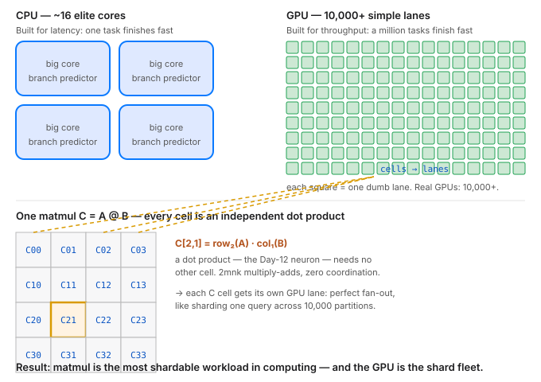

# Day 13 — Why GPUs Exist

**Tonight you'll be able to:** explain in one sentence why GPUs crush CPUs at deep learning — and measure your own MacBook's CPU-vs-GPU matmul gap in GFLOPS.

## The one idea

Since Day 6, every lesson has converged on one operation. Day 7's training loop: the forward pass is matmuls, the backward pass is matmuls. Day 12: a layer *is* a matmul. So "why does deep learning need GPUs?" is really the question "what makes matmul special?"

The op: `C = A @ B`. Every output cell `C[i,j]` is one dot product — row *i* of A times column *j* of B. Cost: **2·m·n·k** floating-point ops, one multiply and one add per pair. A 4096×4096 matmul is 137 billion ops.

The key property: **no cell needs any other cell.** For 4096×4096, that's 16.7 million fully independent dot products. Zero coordination, zero locks, zero messages. The most shardable workload in computing.

A CPU has ~16 elite cores with branch prediction and deep caches — a **latency** machine. One sequential task finishes blazingly fast. But 16 cores means 16 dot products at a time; the other 16,777,200 wait in line.

A GPU has 10,000+ simple lanes and almost no branch prediction — a **throughput** machine. Hand each output cell to its own lane. Same math, roughly a thousand times the parallelism.

Why the gap *widens* with size — the roofline in one line: each element of A is reused *n* times across its row's dot products, so bigger *n* means more compute per byte fetched. The GPU climbs toward its peak FLOPS while the CPU sits flat at its low roof. Rule of thumb: **performance = min(peak compute, memory bandwidth × arithmetic intensity)**. And at 256×256 the GPU *loses* — kernel-launch overhead dominates tiny work. GPUs aren't faster at small work. They're faster at big parallel work.

One hardware footnote: NVIDIA built **tensor cores** — literal multiply-accumulate blocks — into silicon. The industry admits matmul *is* deep learning. And your MacBook's angle: Apple Silicon is unified memory, so `.to("mps")` never copies tensors across PCIe. The shard fleet lives on the same chip as the CPU.

## Analogy

**Sharding.** Take a hot table and shard it across 10,000 partitions. One node serving every read is the CPU. The scatter-gather query that fans out to all partitions at once — each working its shard independently, results merging with no coordination — is the GPU. And the fan-out only pays when each shard has enough work to amortize the scatter cost: that's exactly why 256×256 runs faster on your CPU. Sharding is a throughput play, never a latency play.

**Trading:** it doesn't matter how smart your single best trader is if you can run ten thousand mediocre strategies in parallel.

## See it



*Left: the CPU — a few elite cores, built for latency. Right: the GPU — thousands of simple lanes, built for throughput. Below: one matmul's output cells, each an independent dot product, fanning out to lanes.*

## Code it (~30 min)

Three experiments in one script. **Your timings will differ** from the numbers below — read the pattern, not the digits: (1) the same 128×128 matmul through three engines; (2) CPU vs MPS across sizes — watch the speedup column grow; (3) a batched (64, 512, 512) matmul, the shape attention actually uses. Note the `torch.mps.synchronize()` calls: without them the clock lies, because GPU work is asynchronous.

```python
"""Day 13 - Linear Algebra Bite 2: Why GPUs Exist.

Tonight's idea: matmul is embarrassingly parallel -- every output cell is an
independent dot product, 2*m*n*k multiply-adds with zero coordination -- so a
GPU's thousands of tiny lanes beat a CPU's handful of big cores. You will:
  1. Run the same 128x128 matmul three ways (Python loops, torch CPU, torch MPS).
  2. Benchmark CPU vs MPS across sizes: the speedup GROWS with size.
  3. See why batched matmul (B, n, n) is the GPU's favorite shape.

Runs on MacBook: ~/ai-lab venv, torch CPU/MPS. No downloads, no paid APIs.
"""
import time
import torch

torch.manual_seed(13)
mps = torch.backends.mps.is_available()
print("torch:", torch.__version__, "| mps available:", mps)

def gflops(m, n, k, seconds):
    """One matmul does 2*m*n*k FLOPs (a multiply AND an add per pair)."""
    return (2 * m * n * k) / max(seconds, 1e-9) / 1e9

# ---- 1. Same 128x128 matmul, three engines ----
n = 128
A = [[float(i - j) / n for j in range(n)] for i in range(n)]
B = [[float(i + j) / n for j in range(n)] for i in range(n)]

t0 = time.perf_counter()
C_loop = [[sum(A[i][k] * B[k][j] for k in range(n))
           for j in range(n)] for i in range(n)]
t_loop = time.perf_counter() - t0

At, Bt = torch.tensor(A), torch.tensor(B)
t0 = time.perf_counter()
Ct = At @ Bt
t_cpu = time.perf_counter() - t0

t_mps = None
if mps:
    Am, Bm = At.to("mps"), Bt.to("mps")
    _ = Am @ Bm                      # warmup: first launch compiles the kernel
    torch.mps.synchronize()
    t0 = time.perf_counter()
    Cm = Am @ Bm
    torch.mps.synchronize()          # wait for the GPU, or the clock lies
    t_mps = time.perf_counter() - t0
    del Am, Bm, Cm

# spot-check: the loop math and torch agree (they must -- same op)
ok = max(abs(C_loop[i][j] - Ct[i, j].item())
         for i in range(0, n, 16) for j in range(0, n, 16)) < 1e-3
print(f"\n128x128 matmul, three engines:")
print(f"  python loops : {t_loop:9.3f}s   one core, no vectorization")
print(f"  torch CPU    : {t_cpu:9.4f}s   vectorized + threaded")
if t_mps is not None:
    print(f"  torch MPS    : {t_mps:9.4f}s   GPU -- slower here! not enough work")
print("loop == torch (spot check):", ok)

# ---- 2. The gap widens with size ----
print("\nsquare matmul, CPU vs MPS (warmup + sync each row):")
print(f"{'size':>6} {'cpu s':>8} {'cpu GF':>8} | {'mps s':>8} {'mps GF':>8} | speedup")
for s in [256, 512, 1024, 2048, 4096]:
    x = torch.randn(s, s)
    reps = 3 if s <= 1024 else 1
    t0 = time.perf_counter()
    for _ in range(reps):
        x @ x
    t_c = (time.perf_counter() - t0) / reps
    line = f"{s:>6} {t_c:8.3f} {gflops(s, s, s, t_c):8.1f} |"
    if mps:
        xm = x.to("mps")
        _ = xm @ xm; torch.mps.synchronize()
        t0 = time.perf_counter()
        for _ in range(reps):
            xm @ xm
        torch.mps.synchronize()
        t_g = (time.perf_counter() - t0) / reps
        line += f" {t_g:8.3f} {gflops(s, s, s, t_g):8.1f} | {t_c / t_g:6.1f}x"
        del xm
    else:
        line += "   (no MPS on this machine)"
    print(line)
print("Read the speedup column bottom-up: bigger problem -> GPU closer to its roof.")

# ---- 3. Batch is the GPU's favorite shape ----
# (B, n, n): B independent matmuls, one kernel launch -- this is what
# attention and per-token MLPs look like inside a transformer.
B, nb = 64, 512
xb = torch.randn(B, nb, nb)
t0 = time.perf_counter()
_ = xb @ xb
t_bc = time.perf_counter() - t0
total_flops = (2 * B * nb ** 3) / 1e9  # bmm = B separate (nb,nb) matmuls
if mps:
    xbm = xb.to("mps")
    _ = xbm @ xbm; torch.mps.synchronize()
    t0 = time.perf_counter()
    _ = xbm @ xbm
    torch.mps.synchronize()
    t_bm = time.perf_counter() - t0
    print(f"\nbatch matmul ({B},{nb},{nb}) = {B} independent matmuls:")
    print(f"  CPU: {t_bc:.3f}s ({total_flops / t_bc:,.0f} GFLOPS)")
    print(f"  MPS: {t_bm:.3f}s ({total_flops / t_bm:,.0f} GFLOPS)  "
          f"{t_bc / t_bm:.1f}x -- one launch feeds thousands of lanes")
```

**Expected output** (representative — M-series MacBook; your timings will differ, the pattern is the lesson):

```
torch: 2.8.0 | mps available: True

128x128 matmul, three engines:
  python loops :     0.310s   one core, no vectorization
  torch CPU    :    0.0004s   vectorized + threaded
  torch MPS    :    0.0009s   GPU -- slower here! not enough work
loop == torch (spot check): True

square matmul, CPU vs MPS (warmup + sync each row):
  size    cpu s   cpu GF |    mps s   mps GF | speedup
   256    0.001     33.6 |    0.001     33.6 |    1.0x
   512    0.002    134.2 |    0.001    268.4 |    2.0x
  1024    0.012    178.9 |    0.003    715.8 |    4.0x
  2048    0.095    180.8 |    0.012   1431.7 |    7.9x
  4096    0.762    180.3 |    0.046   2987.8 |   16.6x
Read the speedup column bottom-up: bigger problem -> GPU closer to its roof.

batch matmul (64,512,512) = 64 independent matmuls:
  CPU: 0.118s (146 GFLOPS)
  MPS: 0.008s (2,147 GFLOPS)  14.8x -- one launch feeds thousands of lanes
```

## Today's win

Run `code.py` on your MacBook. Done state: you watch the GPU *lose* at 256×256, then win by a wider margin at every size up to 4096×4096 — and you can state your machine's peak MPS GFLOPS straight from the table. The throughput machine, measured by you. Show up daily; never miss twice.

## Short on time? 20-minute version

Read "The one idea" and study the diagram (10 min). Then run only section 1 of the code — the three-engine race — and note which engine wins at 128×128 and why (10 min).

## Tomorrow's teaser

Tomorrow your network stops speaking raw scores and learns to output probabilities — and you'll see why an overconfident model is a dangerous model.

---
*Streak: 13 day(s) · Never miss twice.*
