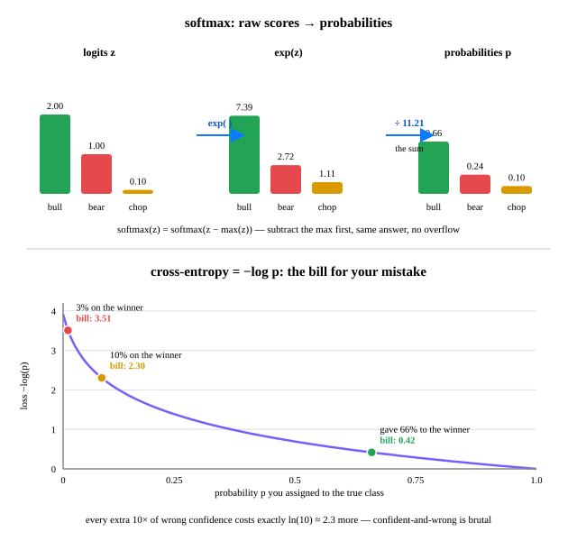

# Day 14 — Softmax & Cross-Entropy

**Tonight you'll be able to:** turn any model's raw scores into probabilities with softmax, and read the loss behind nearly every classifier in AI as a bill for your mistakes.

## The one idea

Your neurons spit out **raw scores** — logits. Day 12 ended there: three neurons, three scores, one per class. But classification needs something stricter: *how much of my belief goes on each class?* That's a probability distribution (Day 10's vocabulary) — numbers that are ≥0 and sum to 1. Raw scores aren't: they can be negative, and 2.0 + 1.0 + 0.1 = 3.1, not 1.

**Softmax is the two-step fix:** exponentiate each score (kills negatives, stretches the gaps between scores), then divide by the sum:

`softmax(z_i) = e^(z_i) / Σ_j e^(z_j)`

Exponentiation makes softmax care only about *differences*: add 1000 to every score and the answer doesn't move — softmax(z) = softmax(z − c). That's a free overflow fix: subtract the max score first, exp stays small, result identical.

**Cross-entropy is the bill.** The truth is a one-hot vector (1 on the winner, 0 everywhere else), and the loss only asks what you paid for the *right* answer:

`CE = −Σ y_i log p_i = −log p_true`

66% on the winner → 0.42. 10% on the winner → 2.30. 3% → 3.51. Every extra 10× of wrong confidence costs exactly ln(10) ≈ 2.3 more. Softmax states what you believe; cross-entropy charges you for being wrong about it.

**Day 11 connection:** −log p_true is the negative log-likelihood of the true class — so minimizing cross-entropy *is* maximum likelihood. Your Days 5–9 MSE loops were Gaussian MLE; every classifier since 2015 has been categorical MLE wearing this loss.

**The punchline gradient:** `dL/dz_i = p_i − y_i`. Softmax + cross-entropy fuse into one elegant derivative: the gradient on each score is just *prediction minus target*. Same "error" shape as Day 6's error × input — deep learning's favorite trick, showing up again.

## Analogy

**Logits are conviction scores; softmax is your position sizer.** You score three setups — bull, bear, chop — and softmax turns conviction into weights summing to 100% of the book. And it's an aggressive allocator: e^conviction weighting concentrates hard on your highest-conviction idea, like sizing up an A-quality setup.

**Cross-entropy is the book's P&L for mis-sizing.** It ignores everything except the weight you put on the trade that *worked*: 10% on the winner, pay −log(0.10) = 2.3. Confident-and-wrong is the blow-up trade — the cost grows without bound as your confidence in the wrong answer nears 100%.

Systems brain bonus: softmax is also a load balancer — raw health scores in, traffic fractions summing to 1 out.

## See it



*Top: logits [2.0, 1.0, 0.1] → exp → ÷11.21 → probabilities. Bottom: the −log p penalty curve — what the model paid for each level of belief in the true class.*

## Code it (~30 min)

On your MacBook (`~/ai-lab`, torch with MPS): five acts — hand-rolled softmax vs torch, the overflow gotcha, cross-entropy by hand vs the library, the p − y gradient check, and your turn: regime scores → allocation weights (Day 12's three neurons, one matmul). Full runnable script in `code.py`.

```python
import torch
import torch.nn.functional as F

# 1. softmax by hand
logits = torch.tensor([2.0, 1.0, 0.1])          # [bull, bear, chop] conviction
hand = torch.exp(logits) / torch.exp(logits).sum()
lib  = F.softmax(logits, dim=0)                  # matches to 6 decimals

# 2. the overflow gotcha: exp(1002) = inf -> nan; subtract max first
big = torch.tensor([1000.0, 1001.0, 1002.0])
naive  = torch.exp(big) / torch.exp(big).sum()   # [nan, nan, nan]
stable = F.softmax(big, dim=0)                   # [0.0900, 0.2447, 0.6652]

# 3. cross-entropy: -log(p_true). F.cross_entropy takes RAW logits.
probs = F.softmax(logits, dim=0)
ce = F.cross_entropy(logits.unsqueeze(0), torch.tensor([0]))  # 0.4170

# 4. the punchline gradient: dL/dz = p - y
z = logits.clone().requires_grad_(True)
F.cross_entropy(z.unsqueeze(0), torch.tensor([0])).backward()
# z.grad == probs - one_hot(0) == [-0.3410, 0.2424, 0.0986]

# 5. your turn: regime scores -> allocation weights
features = torch.tensor([0.04, 1.25, 0.62])      # momentum, volume_z, vol_spike
W = torch.tensor([[ 1.20,  0.35, -0.80],
                  [-1.05,  0.15,  0.60],
                  [ 0.30, -0.90,  0.45]])
b = torch.tensor([0.10, 0.05, 0.00])
alloc = F.softmax(W @ features + b, dim=0)       # bull 33.2% | bear 53.6% | chop 13.2%
```

**Expected output** (numbers from the lesson's `code.py` run):

```
=== 1. Logits -> probabilities: softmax by hand ===
hand : [0.6590011119842529, 0.24243295192718506, 0.09856589883565903]
torch: [0.6590011119842529, 0.24243295192718506, 0.09856589883565903]
sum  : 1.000000

=== 2. The overflow gotcha (and the one-line fix) ===
naive softmax: [nan, nan, nan]
torch softmax : [0.09003057330846786, 0.2447284607887268, 0.6652409434318542]
softmax(z) == softmax(z - max(z)): shifting scores changes nothing

=== 3. Cross-entropy: the loss = -log(p_true) ===
hand: -log(0.6590) = 0.4170
lib : F.cross_entropy(raw_logits, target)  = 0.4170
(minimizing this = maximizing likelihood: Day 11's MLE, one line)

=== 4. The punchline gradient: dL/dz = p - y ===
autograd dL/dz: ['-0.3410', '0.2424', '0.0986']
p - y        : ['-0.3410', '0.2424', '0.0986']
identical. Gradient = how-wrong x how-much-I-pushed: the Day 6 pattern.

=== 5. Your turn: regime scores -> allocation weights ===
logits: ['0.0895', '0.5675', '-0.8340']
alloc : bull 33.2% | bear 53.6% | chop 13.2%
loss if bear wins (-log p): 0.6239

WIN: you turned raw conviction into a sized book - and priced the mistake.
```

## Today's win

Run `code.py` and confirm three things: (1) your hand-rolled softmax matches `torch.softmax` to 6 decimals; (2) naive softmax on `[1000, 1001, 1002]` → `nan` while torch's stays sane (max-subtraction); (3) autograd prints `dL/dz = [-0.3410, 0.2424, 0.0986]` — exactly `p − y`.

**Done-state:** you can write softmax from memory, and you know why `F.cross_entropy` takes *raw logits*, not probabilities — it applies log-softmax inside.

## Short on time? 20-minute version

Read **The one idea**, then run only §1–§4 of the code (skip §5, the regime toy). The non-negotiable moment: watch `dL/dz` print exactly `p − y` — that single line is why this loss runs nearly every classifier in AI.

## Tomorrow's teaser

Tomorrow: neurons only eat numbers — so how do you feed one a word? A ticker symbol? A category? The trick is older than deep learning, and it's quietly everywhere in modern AI.

---
*Streak: 14 day(s) · Never miss twice.*
