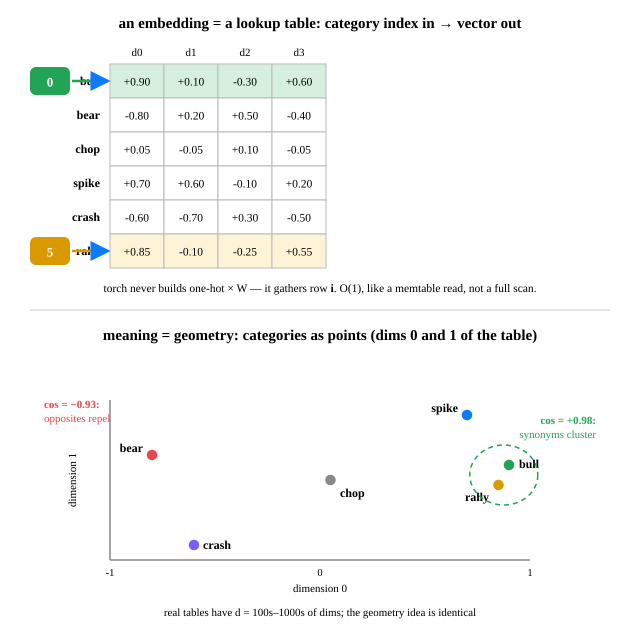

# Day 15 — Embeddings: Categories → Vectors

**Tonight you'll be able to:** explain why every category a model touches lives as a point in vector space, look vectors up by index with `nn.Embedding`, read meaning as geometry — and train the geometry with one gradient step.

## The one idea

Neurons only eat numbers (Day 12: everything is a dot product). So how do you feed one a *category* — a word, a ticker symbol, a market regime? The naive answer is **one-hot**: give every category its own axis. `bull` becomes `[1, 0, 0, 0, 0, 0]`, `rally` becomes `[0, 0, 0, 0, 0, 1]`.

It works, and it's terrible twice over. First, it's **sparse**: a 50,000-word vocabulary means 50,000-dim vectors that are 99.998% zeros — pure waste. Second, it's **meaningless**: the dot product of any two distinct one-hot vectors is exactly 0. `bull` is exactly as far from `rally` as from `crash`. No notion of similarity can fit in the encoding.

**An embedding is a learned lookup table.** A matrix of shape `(V, d)` — one dense `d`-dim row per category — where `d` is small (4 in tonight's toy; hundreds to thousands in real models). Feeding the model category `i` means handing it row `i`. `nn.Embedding` *is* that table, and it's a **Parameter**, not data: it has `requires_grad`, so Day 7's training loop writes into it.

Two engineering facts that matter. **Lookup, not matmul:** `one_hot @ W` gives the same row, but torch never does the dense multiply — it gathers row `i` directly, O(1). **Sparse updates:** the gradient only touches the rows you looked up — a partial write, not a full-table rewrite.

**Meaning is geometry, and geometry is trained.** Nobody hand-places the rows. Gradient descent nudges them so the loss shrinks, and synonyms end up pointing the same way. Read the result with **cosine similarity** — the dot product of two unit vectors (Day 12's core op again): +1 means same direction, −1 means opposite, 0 means unrelated. Tonight you'll watch one gradient step pull `bull` toward `rally` and the cosine move in real time.

> **Analogy — consistent hashing, but learned.** Consistent hashing turns an arbitrary string — a cache key, a node name — into a stable coordinate on a ring. An embedding turns an arbitrary category into a stable coordinate in vector space. The honest contrast: consistent hashing *deliberately* spreads unrelated keys apart. An embedding does the opposite on purpose — training pulls similar things together, so position *means* something.
>
> **It's also a registry read.** Service name in, endpoint config out — except the config rows are learned, and a gradient step is a partial write that only touches the rows you read. Your memtable instincts apply: index → row, O(1) gather, never a full scan.

## See it



*Top: the table — index 0 fetches the `bull` row, index 5 fetches `rally`. Bottom: the same rows plotted on dims 0–1 — synonyms cluster, opposites repel, neutral sits near the origin.*

## Code it (~30 min)

On your MacBook (`~/ai-lab`, torch with MPS): five acts — the one-hot dead end, the lookup table, lookup == one-hot @ W without the waste, meaning-as-geometry, and one gradient step that moves meaning.

```python
"""Day 15 - Embeddings: Categories to Vectors.

Neurons only eat numbers, so a category (a word, a ticker, a regime) has to
become a vector. One-hot does it - but sparsely, and every category ends up
equidistant from every other (no meaning). An embedding is a LEARNED lookup
table: each category id maps to a dense vector, and the vectors are trained by
gradient descent so that similar things land near each other.

Runs on the ~/ai-lab venv: torch CPU or MPS, no paid APIs.
Expected output is shown in the lesson HTML - numbers below should match to the
printed precision.
"""
import torch
import torch.nn.functional as F

torch.set_printoptions(precision=4)

vocab = ["bull", "bear", "chop", "spike", "crash", "rally"]
V, D = len(vocab), 4          # 6 categories, 4-dim vectors

print("=== 1. The one-hot problem: categories with no meaning ===")
idx = torch.tensor([0, 5])                       # bull, rally
oh = F.one_hot(idx, num_classes=V).float()
print("one-hot 'bull' :", oh[0].tolist())
print("one-hot 'rally':", oh[1].tolist())
print(f"dot(bull, rally) = {float(oh[0] @ oh[1]):.1f}   "
      f"dot(bull, bear) = {float(oh[0] @ F.one_hot(torch.tensor(1), V).float()):.1f}")
print("every category is exactly as far from every other. No meaning fits.")

print("\n=== 2. The fix: a lookup table of learned vectors ===")
W = torch.tensor([                               # the embedding TABLE (6 x 4)
    [ 0.90,  0.10, -0.30,  0.60],   # bull
    [-0.80,  0.20,  0.50, -0.40],   # bear
    [ 0.05, -0.05,  0.10, -0.05],   # chop
    [ 0.70,  0.60, -0.10,  0.20],   # spike
    [-0.60, -0.70,  0.30, -0.50],   # crash
    [ 0.85, -0.10, -0.25,  0.55]])  # rally
emb = torch.nn.Embedding.from_pretrained(W)      # a Parameter, not data
vecs = emb(idx)
print("emb([0, 5]) =")
for i, w in enumerate(vocab):
    if i in (0, 5):
        print(f"  {w:>6}:", [f"{v:.4f}" for v in emb.weight[i].tolist()])

print("\n=== 3. Lookup == one-hot @ W, minus the waste ===")
matmul_way = oh @ W                              # dense multiply: O(V * D)
gather_way = emb(idx)                            # row fetch: O(1) gather
print("max |one-hot@W - lookup| =", float((matmul_way - gather_way).abs().max()))
print("torch never does the matmul - it gathers the row, like a memtable read.")

print("\n=== 4. Meaning is geometry: cosine similarity ===")
def sim(a, b):
    return float(F.cosine_similarity(emb.weight[a].unsqueeze(0),
                                     emb.weight[b].unsqueeze(0)))
pairs = [("bull", "rally", sim(0, 5)), ("bull", "crash", sim(0, 4)),
         ("bull", "bear", sim(0, 1)), ("chop", "bear", sim(2, 1))]
for a, b, s in pairs:
    print(f"  cos({a:>5}, {b:>5}) = {s:+.4f}")
print("synonyms point the same way; opposites point away; chop points nowhere.")

print("\n=== 5. The table LEARNS: pull 'bull' toward 'rally' ===")
print(f"before: cos(bull, rally) = {sim(0, 5):+.4f}")
loss = (emb(torch.tensor([0])) - emb(torch.tensor([5]))).pow(2).sum()
loss.backward()
touched = torch.where(emb.weight.grad.abs().sum(dim=1) > 0)[0].tolist()
print("rows the gradient touched:", touched, "(only the looked-up rows)")
with torch.no_grad():                            # one manual SGD step, lr = 0.1
    emb.weight -= 0.1 * emb.weight.grad
print(f"after : cos(bull, rally) = {sim(0, 5):+.4f}")
print("Day 7's training loop writes into this table. That is how meaning forms.")

print("\nWIN: you turned categories into geometry - and trained the geometry.")
```

**Expected output:**

```
=== 1. The one-hot problem: categories with no meaning ===
one-hot 'bull' : [1.0, 0.0, 0.0, 0.0, 0.0, 0.0]
one-hot 'rally': [0.0, 0.0, 0.0, 0.0, 0.0, 1.0]
dot(bull, rally) = 0.0   dot(bull, bear) = 0.0
every category is exactly as far from every other. No meaning fits.

=== 2. The fix: a lookup table of learned vectors ===
emb([0, 5]) =
  bull: ['0.9000', '0.1000', '-0.3000', '0.6000']
  rally: ['0.8500', '-0.1000', '-0.2500', '0.5500']

=== 3. Lookup == one-hot @ W, minus the waste ===
max |one-hot@W - lookup| = 0.0
torch never does the matmul - it gathers the row, like a memtable read.

=== 4. Meaning is geometry: cosine similarity ===
  cos( bull, rally) = +0.9825
  cos( bull, crash) = -0.8134
  cos( bull,  bear) = -0.9264
  cos( chop,  bear) = +0.1448
synonyms point the same way; opposites point away; chop points nowhere.

=== 5. The table LEARNS: pull 'bull' toward 'rally' ===
before: cos(bull, rally) = +0.9825
rows the gradient touched: [0, 5] (only the looked-up rows)
after : cos(bull, rally) = +0.9937
Day 7's training loop writes into this table. That is how meaning forms.

WIN: you turned categories into geometry - and trained the geometry.
```

## Today's win

Run `code.py` and confirm four things: (1) one-hot dots are all `0.0` — no meaning fits; (2) `one-hot @ W` equals the gather to the last decimal, so you believe the O(1) story; (3) `cos(bull, rally) = +0.9825`, `cos(bull, bear) = -0.9264`, chop near zero; (4) the gradient touches only rows `[0, 5]`, and one SGD step moves the cosine `0.9825 → 0.9937`.

**Done-state:** you know why `nn.Embedding` takes *integer indices*, not one-hot vectors — and you can explain what an embedding is to a distributed-systems engineer in one sentence: a learned registry from category to vector, written by gradient descent.

## Short on time? 20-minute version

Read **The one idea**, then run only §1–§4 of the code (skip §5, the gradient step). The non-negotiable moment: the cosine table — `+0.98` for synonyms, `-0.93` for opposites. That's meaning you can measure with a dot product.

## Tomorrow's teaser

Tomorrow: everything you've built — tensors, autograd, losses, descent, the training loop — meets data that isn't made up. The first real build of Phase A.

*Streak: 15 day(s) · Never miss twice.*
